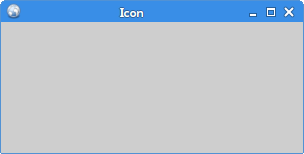

# Hello Worl

##本章学习Qt的基本功能


这个简单的小例子展示的是一个小窗口。但是我们可以在这个小窗口上面做很多事情，改变大小，最大化，最小化等，这需要很多代码才能实现。这在很多应用中很常见，没必要每次都要重写这部分代码，Qt已经提供了这些功能。PyQt5是一个高级的工具集合，相比使用低级的工具，PyQt能省略上百行代码。

## 例1，简单的窗口

``` python
#!/usr/bin/python3
# -*- coding: utf-8 -*-

"""
ZetCode PyQt5 tutorial 

In this example, we create a simple
window in PyQt5.

author: Jan Bodnar
website: zetcode.com 
last edited: January 2015
"""

import sys
from PyQt5.QtWidgets import QApplication, QWidget


if __name__ == '__main__':
    
    app = QApplication(sys.argv)

    w = QWidget()
    w.resize(250, 150)
    w.move(300, 300)
    w.setWindowTitle('Simple')
    w.show()
    
    sys.exit(app.exec_())
```
运行上面的代码，能展示出一个小窗口。下面是每行代码的讲解。
```
import sys
from PyQt5.QtWidgets import QApplication, QWidget
```
这里引入了PyQt5.QtWidgets模块，这个模块包含了基本的组件。
```
app = QApplication(sys.argv)
```
每个PyQt5应用都必须创建一个应用对象。sys.argv是一组命令行参数的列表。Python可以在shell里运行，这个参数提供对脚本控制的功能。
```
w = QWidget()
```
QWidget空间是一个用户界面的基本空间，它提供了基本的应用构造器。默认情况下，构造器是没有父级的，没有父级的构造器被称为窗口（window）。
```
w.resize(250, 150)
```
resize()方法能改变控件的大小，这里的意思是窗口宽250px，高150px。
```
w.move(300, 300)
```
move()是修改控件位置的的方法。它把控件放置到屏幕坐标的(300, 300)的位置。注：屏幕坐标系的原点是屏幕的左上角。
```
w.setWindowTitle('Simple')
```
我们给这个窗口添加了一个标题，标题在标题栏展示（虽然这看起来是一句废话，但是后面还有很多栏，还是要注意一下，多了就蒙了）。
```
w.show()
```
show()能让控件在桌面上显示出来。控件在内存里创建，之后才能在显示器上显示出来。
```
sys.exit(app.exec_())
```
最后，我们进入了应用的主循环中，事件处理器这个时候开始工作。主循环从窗口上接收事件，并把事件传入到派发到应用控件里。当调用exit()方法或直接销毁主控件时，主循环就会结束。sys.exit()方法能确保主循环安全退出。外部环境能通知主控件怎么结束。

exec_()之所以有个下划线，是因为exec是一个Python的关键字。

程序预览：


## 例2，带窗口图标

窗口图标通常是显示在窗口的左上角，标题栏的最左边。下面的例子就是怎么用PyQt5创建一个这样的窗口。
```python
#!/usr/bin/python3
# -*- coding: utf-8 -*-

"""
ZetCode PyQt5 tutorial 

This example shows an icon
in the titlebar of the window.

author: Jan Bodnar
website: zetcode.com 
last edited: January 2015
"""

import sys
from PyQt5.QtWidgets import QApplication, QWidget
from PyQt5.QtGui import QIcon


class Example(QWidget):
    
    def __init__(self):
        super().__init__()
        
        self.initUI()
        
        
    def initUI(self):
        
        self.setGeometry(300, 300, 300, 220)
        self.setWindowTitle('Icon')
        self.setWindowIcon(QIcon('web.png'))        
    
        self.show()
        
        
if __name__ == '__main__':
    
    app = QApplication(sys.argv)
    ex = Example()
    sys.exit(app.exec_()) 
```
前一个例子是使用的[过程式编程](https://www.wikiwand.com/zh/%E8%BF%87%E7%A8%8B%E5%BC%8F%E7%BC%96%E7%A8%8B)。Python还支持[面向对象](https://www.wikiwand.com/zh/%E9%9D%A2%E5%90%91%E5%AF%B9%E8%B1%A1%E7%A8%8B%E5%BA%8F%E8%AE%BE%E8%AE%A1)的编程：
```
class Example(QWidget):
    
    def __init__(self):
        super().__init__()
        ...
```
面向对象编程最重要的三个部分是类(class)、数据和方法。我们创建了一个类的调用，这个类继承自QWidget。这就意味着，我们调用了两个构造器，一个是这个类本身的，一个是这个类继承的。super()构造器方法返回父级的对象。`__init__()`方法是构造器的一个方法。
```
self.initUI() 
```
使用`initUI()`方法创建一个GUI。
```
# 自己准备一个web.png
self.setGeometry(300, 300, 300, 220)
self.setWindowTitle('Icon')
self.setWindowIcon(QIcon('web.png'))  
```
上面的三个方法都继承自`QWidget`类。setGeometry()有两个作用：把窗口放到屏幕上并且设置窗口大小。参数分别代表屏幕坐标的x、y和窗口大小的宽、高。也就是说这个方法是resize()和move()的合体。最后一个方法是添加了图标。先创建一个QIcon对象，然后接受一个路径作为参数显示图标。
```
if __name__ == '__main__':
    
    app = QApplication(sys.argv)
    ex = Example()
    sys.exit(app.exec_())
````
应用和示例的对象创立，主循环开始。
程序预览：



## 例3，提示框
```
#!/usr/bin/python3
# -*- coding: utf-8 -*-

"""
ZetCode PyQt5 tutorial 

This example shows a tooltip on 
a window and a button.

author: Jan Bodnar
website: zetcode.com 
last edited: January 2015
"""

import sys
from PyQt5.QtWidgets import (QWidget, QToolTip, 
    QPushButton, QApplication)
from PyQt5.QtGui import QFont    


class Example(QWidget):
    
    def __init__(self):
        super().__init__()
        
        self.initUI()
        
        
    def initUI(self):
        
        QToolTip.setFont(QFont('SansSerif', 10))
        
        self.setToolTip('This is a <b>QWidget</b> widget')
        
        btn = QPushButton('Button', self)
        btn.setToolTip('This is a <b>QPushButton</b> widget')
        btn.resize(btn.sizeHint())
        btn.move(50, 50)       
        
        self.setGeometry(300, 300, 300, 200)
        self.setWindowTitle('Tooltips')    
        self.show()
        
        
if __name__ == '__main__':
    
    app = QApplication(sys.argv)
    ex = Example()
    sys.exit(app.exec_())
```
在这个例子中，我们为应用创建了两个提示框。
```
QToolTip.setFont(QFont('SansSerif', 10))
```
这个静态方法设置了提示框的字体，我们使用了10px的SansSerif字体。
```
self.setToolTip('This is a <b>QWidget</b> widget')
```
调用`setTooltip()`创建提示框可以使用富文本格式的内容。
```
btn = QPushButton('Button', self)
btn.setToolTip('This is a <b>QPushButton</b> widget')
```
创建了一个按钮，并且为按钮添加了一个提示框。
```
btn.resize(btn.sizeHint())
btn.move(50, 50)
```
调整按钮大小，并让按钮在屏幕上显示出来，`sizeHint()`方法提供了一个默认的按钮大小。

程序预览：


## 例4，关闭窗口
关闭一个窗口最直观的方式就是点击标题栏的那个叉，这个例子里，我们展示的是如何用程序关闭一个窗口。这里我们将接触到一点single和slots的知识。

本例使用的是QPushButton组件类。

```
QPushButton(string text, QWidget parent = None)
```
text参数是想要显示的按钮名称，parent参数是放在按钮上的组件，在我们的 例子里，这个参数是QWidget。应用中的组件都是一层一层（继承而来的？）的，在这个层里，大部分的组件都有自己的父级，没有父级的组件，是顶级的窗口。
```
#!/usr/bin/python3
# -*- coding: utf-8 -*-

"""
ZetCode PyQt5 tutorial 

This program creates a quit
button. When we press the button,
the application terminates. 

author: Jan Bodnar
website: zetcode.com 
last edited: January 2015
"""

import sys
from PyQt5.QtWidgets import QWidget, QPushButton, QApplication
from PyQt5.QtCore import QCoreApplication


class Example(QWidget):
    
    def __init__(self):
        super().__init__()
        
        self.initUI()
        
        
    def initUI(self):               
        
        qbtn = QPushButton('Quit', self)
        qbtn.clicked.connect(QCoreApplication.instance().quit)
        qbtn.resize(qbtn.sizeHint())
        qbtn.move(50, 50)       
        
        self.setGeometry(300, 300, 250, 150)
        self.setWindowTitle('Quit button')    
        self.show()
        
        
if __name__ == '__main__':
    
    app = QApplication(sys.argv)
    ex = Example()
    sys.exit(app.exec_())
```
这里创建了一个点击之后就退出窗口的按钮。
```
from PyQt5.QtCore import QCoreApplication
```
程序需要QtCore对象。
```
qbtn = QPushButton('Quit', self)
```
创建一个继承自`QPushButton`的按钮。第一个参数是按钮的文本，第二个参数是按钮的父级组件，这个例子中，父级组件就是我们创建的继承自Qwidget的Example类。
```
qbtn.clicked.connect(QCoreApplication.instance().quit)
```
事件传递系统在PyQt5内建的single和slot机制里面。点击按钮之后，信号会被捕捉并给出既定的反应。QCoreApplication包含了事件的主循环，它能添加和删除所有的事件，instance()创建了一个它的实例。QCoreApplication是在QApplication里创建的。 点击事件和能终止进程并退出应用的quit函数绑定在了一起。在发送者和接受者之间建立了通讯，发送者就是按钮，接受者就是应用对象。

程序预览：


## 例5，消息盒子

默认情况下，我们点击标题栏的×按钮，QWidget就会关闭。但是有时候，我们修改默认行为。比如，如果我们打开的是一个文本编辑器，并且做了一些修改，我们就会想在关闭按钮的时候让用户进一步确认操作。
```
#!/usr/bin/python3
# -*- coding: utf-8 -*-

"""
ZetCode PyQt5 tutorial 

This program shows a confirmation 
message box when we click on the close
button of the application window. 

author: Jan Bodnar
website: zetcode.com 
last edited: January 2015
"""

import sys
from PyQt5.QtWidgets import QWidget, QMessageBox, QApplication


class Example(QWidget):
    
    def __init__(self):
        super().__init__()
        
        self.initUI()
        
        
    def initUI(self):               
        
        self.setGeometry(300, 300, 250, 150)        
        self.setWindowTitle('Message box')    
        self.show()
        
        
    def closeEvent(self, event):
        
        reply = QMessageBox.question(self, 'Message',
            "Are you sure to quit?", QMessageBox.Yes | 
            QMessageBox.No, QMessageBox.No)

        if reply == QMessageBox.Yes:
            event.accept()
        else:
            event.ignore()        
        
        
if __name__ == '__main__':
    
    app = QApplication(sys.argv)
    ex = Example()
    sys.exit(app.exec_())
```
如果关闭QWidget，就会产生一个QCloseEvent。改变空间的默认行为，就是替换掉默认的事件处理。
```
reply = QMessageBox.question(self, 'Message',
    "Are you sure to quit?", QMessageBox.Yes | 
    QMessageBox.No, QMessageBox.No)
```
我们创建了一个消息框，上面有俩按钮：Yes和No.第一个字符串显示在消息框的标题栏，第二个字符串显示在对话框，第三个参数是消息框的俩按钮，最后一个参数是默认按钮，这个按钮是默认选中的。返回值在变量`reply`里。
```
if reply == QtGui.QMessageBox.Yes:
    event.accept()
else:
    event.ignore()
```
这里判断返回值，如果点击的是Yes按钮，我们就关闭组件和应用，否者就忽略关闭事件。

程序预览：


## 例6，窗口居中

```
#!/usr/bin/python3
# -*- coding: utf-8 -*-

"""
ZetCode PyQt5 tutorial 

This program centers a window 
on the screen. 

author: Jan Bodnar
website: zetcode.com 
last edited: January 2015
"""

import sys
from PyQt5.QtWidgets import QWidget, QDesktopWidget, QApplication


class Example(QWidget):
    
    def __init__(self):
        super().__init__()
        
        self.initUI()
        
        
    def initUI(self):               
        
        self.resize(250, 150)
        self.center()
        
        self.setWindowTitle('Center')    
        self.show()
        
        
    def center(self):
        
        qr = self.frameGeometry()
        cp = QDesktopWidget().availableGeometry().center()
        qr.moveCenter(cp)
        self.move(qr.topLeft())
        
        
if __name__ == '__main__':
    
    app = QApplication(sys.argv)
    ex = Example()
    sys.exit(app.exec_())
```
QtGui.QDesktopWidget类提供了用户的桌面信息，其中就有屏幕的大小。

```
self.center()
```

这个方法是调用我们下面写的，实现对话框居中的方法。
```
qr = self.frameGeometry()
```
这样我们得到了主窗口的大小。
```
cp = QDesktopWidget().availableGeometry().center()
```
获取到显示器的分辨率，然后得到了中间点的位置。
```
qr.moveCenter(cp)
```
然后把自己窗口的中心点放置到qr的中心点。
```
self.move(qr.topLeft())
```
然后把窗口的坐上角移动到qr的矩形的左上角上，这样就居中了我们自己的窗口。

- [ ] TODO：这个翻译的好扯

**这个例子没有程序预览**