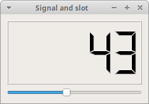

# PyQt6 events and signals
*last modified April 29, 2021*

In this part of the PyQt6 programming tutorial, we explore events and signals occurring in applications.

## Events in PyQt6
GUI applications are event-driven. Events are generated mainly by the user of an application. But they can be generated by other means as well; e.g. an Internet connection, a window manager, or a timer. When we call the application's `exec()` method, the application enters the main loop. The main loop fetches events and sends them to the objects.

In the event model, there are three participants:

- event source
- event object
- event target

The event source is the object whose state changes. It generates events. The *event object* (event) encapsulates the state changes in the event source. The *event target* is the object that wants to be notified. Event source object delegates the task of handling an event to the event target.

PyQt6 has a unique signal and slot mechanism to deal with events. Signals and slots are used for communication between objects. A signal is emitted when a particular event occurs. A slot can be any Python callable. A slot is called when its connected signal is emitted.

## PyQt6 signals and slots
This is a simple example demonstrating signals and slots in PyQt6.

``` python
# file: signals_slots.py
#!/usr/bin/python

"""
ZetCode PyQt6 tutorial

In this example, we connect a signal
of a QSlider to a slot of a QLCDNumber.

Author: Jan Bodnar
Website: zetcode.com
"""

import sys
from PyQt6.QtCore import Qt
from PyQt6.QtWidgets import (QWidget, QLCDNumber, QSlider,
        QVBoxLayout, QApplication)


class Example(QWidget):

    def __init__(self):
        super().__init__()

        self.initUI()


    def initUI(self):

        lcd = QLCDNumber(self)
        sld = QSlider(Qt.Orientations.Horizontal, self)

        vbox = QVBoxLayout()
        vbox.addWidget(lcd)
        vbox.addWidget(sld)

        self.setLayout(vbox)
        sld.valueChanged.connect(lcd.display)

        self.setGeometry(300, 300, 350, 250)
        self.setWindowTitle('Signal and slot')
        self.show()


def main():
    
    app = QApplication(sys.argv)
    ex = Example()
    sys.exit(app.exec())


if __name__ == '__main__':
    main()
```
In our example, we display a `QtGui.QLCDNumber` and a `QtGui.QSlider`. We change the lcd number by dragging the slider knob.
``` python
sld.valueChanged.connect(lcd.display)
```
Here we connect a `valueChanged` signal of the slider to the `display` slot of the lcd number.

The *sender* is an object that sends a signal. The *receiver* is the object that receives the signal. The *slot* is the method that reacts to the signal.



Figure: Signal & slot

## PyQt6 reimplementing event handler

Events in PyQt6 are processed often by reimplementing event handlers.

``` python
# file: reimplement_handler.py
#!/usr/bin/python

"""
ZetCode PyQt6 tutorial

In this example, we reimplement an
event handler.

Author: Jan Bodnar
Website: zetcode.com
"""

import sys
from PyQt6.QtCore import Qt
from PyQt6.QtWidgets import QWidget, QApplication


class Example(QWidget):

    def __init__(self):
        super().__init__()

        self.initUI()


    def initUI(self):

        self.setGeometry(300, 300, 350, 250)
        self.setWindowTitle('Event handler')
        self.show()


    def keyPressEvent(self, e):
        
        if e.key() == Qt.Key.Key_Escape.value:
            self.close()


def main():

    app = QApplication(sys.argv)
    ex = Example()
    sys.exit(app.exec())


if __name__ == '__main__':
    main()
```
In our example, we reimplement the `keyPressEvent` event handler.
``` python
def keyPressEvent(self, e):
    
    if e.key() == Qt.Key.Key_Escape.value:
        self.close()
```
If we click the Escape button, the application terminates.

## PyQt6 event object
Event object is a Python object that contains a number of attributes describing the event. Event object is specific to the generated event type.

``` python
# file: event_object.py
#!/usr/bin/python

"""
ZetCode PyQt6 tutorial

In this example, we display the x and y
coordinates of a mouse pointer in a label widget.

Author: Jan Bodnar
Website: zetcode.com
"""

import sys
from PyQt6.QtCore import Qt
from PyQt6.QtWidgets import QWidget, QApplication, QGridLayout, QLabel


class Example(QWidget):

    def __init__(self):
        super().__init__()

        self.initUI()


    def initUI(self):

        grid = QGridLayout()

        x = 0
        y = 0

        self.text = f'x: {x},  y: {y}'

        self.label = QLabel(self.text, self)
        grid.addWidget(self.label, 0, 0, Qt.Alignment.AlignTop)

        self.setMouseTracking(True)
        self.setLayout(grid)

        self.setGeometry(300, 300, 450, 300)
        self.setWindowTitle('Event object')
        self.show()


    def mouseMoveEvent(self, e):

        x = int(e.position().x())
        y = int(e.position().y())

        text = f'x: {x},  y: {y}'
        self.label.setText(text)


def main():

    app = QApplication(sys.argv)
    ex = Example()
    sys.exit(app.exec())


if __name__ == '__main__':
    main()
```
In this example, we display the x and y coordinates of a mouse pointer in a label widget.
``` python
self.setMouseTracking(True)
```
Mouse tracking is disabled by default, so the widget only receives mouse move events when at least one mouse button is pressed while the mouse is being moved. If mouse tracking is enabled, the widget receives mouse move events even if no buttons are pressed.
``` python
def mouseMoveEvent(self, e):

    x = int(e.position().x())
    y = int(e.position().y())
    ...
```
The e is the event object; it contains data about the event that was triggered. In our case it is mouse move event. With the `position().x()` and `e.position().y()` methods we determine the x and y coordinates of the mouse pointer.
``` python
self.text = f'x: {x},  y: {y}'
self.label = QLabel(self.text, self)
```
The x and y coordinates are displayd in a `QLabel` widget.


Figure: Event object

# PyQt6 event sender

Sometimes it is convenient to know which widget is the sender of a signal. For this, PyQt6 has the sender method.

``` python
event_sender.py
#!/usr/bin/python

"""
ZetCode PyQt6 tutorial

In this example, we determine the event sender
object.

Author: Jan Bodnar
Website: zetcode.com
"""

import sys
from PyQt6.QtWidgets import QMainWindow, QPushButton, QApplication


class Example(QMainWindow):

    def __init__(self):
        super().__init__()

        self.initUI()


    def initUI(self):

        btn1 = QPushButton("Button 1", self)
        btn1.move(30, 50)

        btn2 = QPushButton("Button 2", self)
        btn2.move(150, 50)

        btn1.clicked.connect(self.buttonClicked)
        btn2.clicked.connect(self.buttonClicked)

        self.statusBar()

        self.setGeometry(300, 300, 450, 350)
        self.setWindowTitle('Event sender')
        self.show()


    def buttonClicked(self):

        sender = self.sender()

        msg = f'{sender.text()} was pressed'
        self.statusBar().showMessage(msg)


def main():

    app = QApplication(sys.argv)
    ex = Example()
    sys.exit(app.exec())


if __name__ == '__main__':
    main()
```
We have two buttons in our example. In the `buttonClicked` method we determine which button we have clicked by calling the sender method.
``` python
btn1.clicked.connect(self.buttonClicked)
btn2.clicked.connect(self.buttonClicked)
```
Both buttons are connected to the same slot.
``` python
def buttonClicked(self):

    sender = self.sender()

    msg = f'{sender.text()} was pressed'
    self.statusBar().showMessage(msg)
```
We determine the signal source by calling the sender method. In the statusbar of the application, we show the label of the button being pressed.


Figure: Event sender

## PyQt6 emit signal

Objects created from a `QObject` can emit signals. The following example shows how we to emit custom signals.

``` python
# file: custom_signal.py
#!/usr/bin/python

"""
ZetCode PyQt6 tutorial

In this example, we show how to
emit a custom signal.

Author: Jan Bodnar
Website: zetcode.com
"""

import sys
from PyQt6.QtCore import pyqtSignal, QObject
from PyQt6.QtWidgets import QMainWindow, QApplication


class Communicate(QObject):

    closeApp = pyqtSignal()


class Example(QMainWindow):

    def __init__(self):
        super().__init__()

        self.initUI()


    def initUI(self):

        self.c = Communicate()
        self.c.closeApp.connect(self.close)

        self.setGeometry(300, 300, 450, 350)
        self.setWindowTitle('Emit signal')
        self.show()


    def mousePressEvent(self, e):

        self.c.closeApp.emit()


def main():

    app = QApplication(sys.argv)
    ex = Example()
    sys.exit(app.exec())


if __name__ == '__main__':
    main()
```
We create a new signal called `closeApp`. This signal is emitted during a mouse press event. The signal is connected to the close slot of the `QMainWindow`.

``` python
class Communicate(QObject):

    closeApp = pyqtSignal()
```
A signal is created with the `pyqtSignal` as a class attribute of the external Communicate class.
``` python
self.c = Communicate()
self.c.closeApp.connect(self.close)
```
The custom `closeApp` signal is connected to the close slot of the `QMainWindow`.
``` python
def mousePressEvent(self, event):

    self.c.closeApp.emit()
```
When we click on the window with a mouse pointer, the `closeApp` signal is emitted. The application terminates.

In this part of the PyQt6 tutorial, we have covered signals and slots.