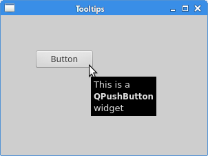

# First programs in PyQt6
*last modified April 23, 2021*

In this part of the PyQt6 tutorial we learn some basic functionality. The examples show a tooltip and an icon, close a window, show a message box and center a window on the desktop.

## PyQt6 simple example
This is a simple example showing a small window. Yet we can do a lot with this window. We can resize it, maximise it or minimise it. This requires a lot of coding. Someone already coded this functionality. Because it is repeated in most applications, there is no need to code it over again. PyQt6 is a high level toolkit. If we would code in a lower level toolkit, the following code example could easily have hundreds of lines.

``` python
# file: simple.py
#!/usr/bin/python

"""
ZetCode PyQt6 tutorial

In this example, we create a simple
window in PyQt6.

Author: Jan Bodnar
Website: zetcode.com
"""


import sys
from PyQt6.QtWidgets import QApplication, QWidget


def main():

    app = QApplication(sys.argv)

    w = QWidget()
    w.resize(250, 200)
    w.move(300, 300)

    w.setWindowTitle('Simple')
    w.show()

    sys.exit(app.exec())


if __name__ == '__main__':
    main()
```

The above code example shows a small window on the screen.

``` python
import sys
from PyQt6.QtWidgets import QApplication, QWidget
```
Here we provide the necessary imports. The basic widgets are located in `PyQt6.QtWidgets` module.

``` python
app = QApplication(sys.argv)
```
Every PyQt6 application must create an application object. The `sys.argv` parameter is a list of arguments from a command line. Python scripts can be run from the shell. It is a way how we can control the startup of our scripts.

``` python
w = QWidget()
```
The QWidget widget is the base class of all user interface objects in PyQt6. We provide the default constructor for QWidget. The default constructor has no parent. A widget with no parent is called a window.

``` python
w.resize(250, 150)
```
The resize method resizes the widget. It is 250px wide and 150px high.
``` python
w.move(300, 300)
```
The move method moves the widget to a position on the screen at x=300, y=300 coordinates.
``` python
w.setWindowTitle('Simple')
```
We set the title of the window with `setWindowTitle`. The title is shown in the titlebar.
``` python
w.show()
```
The show method displays the widget on the screen. A widget is first created in memory and later shown on the screen.
``` python
sys.exit(app.exec())
```
Finally, we enter the mainloop of the application. The event handling starts from this point. The mainloop receives events from the window system and dispatches them to the application widgets. The mainloop ends if we call the exit method or the main widget is destroyed. The `sys.exit` method ensures a clean exit. The environment will be informed how the application ended.


Figure: Simple
## PyQt6 tooltip
We can provide a balloon help for any of our widgets.

``` python
# file: tooltip.py
#!/usr/bin/python

"""
ZetCode PyQt6 tutorial

This example shows a tooltip on
a window and a button.

Author: Jan Bodnar
Website: zetcode.com
"""

import sys
from PyQt6.QtWidgets import (QWidget, QToolTip,
    QPushButton, QApplication)
from PyQt6.QtGui import QFont


class Example(QWidget):

    def __init__(self):
        super().__init__()

        self.initUI()


    def initUI(self):

        QToolTip.setFont(QFont('SansSerif', 10))

        self.setToolTip('This is a <b>QWidget</b> widget')

        btn = QPushButton('Button', self)
        btn.setToolTip('This is a <b>QPushButton</b> widget')
        btn.resize(btn.sizeHint())
        btn.move(50, 50)

        self.setGeometry(300, 300, 300, 200)
        self.setWindowTitle('Tooltips')
        self.show()


def main():

    app = QApplication(sys.argv)
    ex = Example()
    sys.exit(app.exec())


if __name__ == '__main__':
    main()
```
In this example, we show a tooltip for two PyQt6 widgets.

``` python
QToolTip.setFont(QFont('SansSerif', 10))
```

This static method sets a font used to render tooltips. We use a 10pt SansSerif font.

``` python
self.setToolTip('This is a <b>QWidget</b> widget')
```

To create a tooltip, we call the `setTooltip` method. We can use rich text formatting.

``` python
btn = QPushButton('Button', self)
btn.setToolTip('This is a <b>QPushButton</b> widget')
```

We create a push button widget and set a tooltip for it.

``` python
btn.resize(btn.sizeHint())
btn.move(50, 50)
```
The button is being resized and moved on the window. The `sizeHint` method gives a recommended size for the button.


Figure: Tooltips
## PyQt6 quit button
The obvious way to close a window is to click on the x mark on the titlebar. In the next example, we show how we can programatically close our window. We will briefly touch signals and slots.

The following is the constructor of a QPushButton widget that we use in our example.
``` python
QPushButton(string text, QWidget parent = None)
```
The text parameter is a text that will be displayed on the button. The parent is a widget on which we place our button. In our case it will be a `QWidget`. Widgets of an application form a hierarchy. In this hierarchy, most widgets have their parents. Widgets without parents are toplevel windows.

```python
# file: quit_button.py
#!/usr/bin/python

"""
ZetCode PyQt6 tutorial

This program creates a quit
button. When we press the button,
the application terminates.

Author: Jan Bodnar
Website: zetcode.com
"""

import sys
from PyQt6.QtWidgets import QWidget, QPushButton, QApplication

class Example(QWidget):

    def __init__(self):
        super().__init__()

        self.initUI()


    def initUI(self):

        qbtn = QPushButton('Quit', self)
        qbtn.clicked.connect(QApplication.instance().quit)
        qbtn.resize(qbtn.sizeHint())
        qbtn.move(50, 50)

        self.setGeometry(300, 300, 350, 250)
        self.setWindowTitle('Quit button')
        self.show()


def main():

    app = QApplication(sys.argv)
    ex = Example()
    sys.exit(app.exec())


if __name__ == '__main__':
    main()
```
In this example, we create a quit button. Upon clicking on the button, the application terminates.
``` python
qbtn = QPushButton('Quit', self)
```
We create a push button. The button is an instance of the QPushButton class. The first parameter of the constructor is the label of the button. The second parameter is the parent widget. The parent widget is the Example widget, which is a `QWidget` by inheritance.
``` python
qbtn.clicked.connect(QApplication.instance().quit)
```
The event processing system in PyQt6 is built with the signal & slot mechanism. If we click on the button, the signal clicked is emitted. The slot can be a Qt slot or any Python callable.

`QCoreApplication`, which is retrieved with `QApplication.instance`, contains the main event loop—it processes and dispatches all events. The clicked signal is connected to the quit method which terminates the application. The communication is done between two objects: the sender and the receiver. The sender is the push button, the receiver is the application object.


Figure: Quit button

## PyQt6 message box
By default, if we click on the x button on the titlebar, the `QWidget` is closed. Sometimes we want to modify this default behaviour. For example, if we have a file opened in an editor to which we did some changes. We show a message box to confirm the action.

``` python
# file: messagebox.py
#!/usr/bin/python

"""
ZetCode PyQt6 tutorial

This program shows a confirmation
message box when we click on the close
button of the application window.

Author: Jan Bodnar
Website: zetcode.com
"""

import sys
from PyQt6.QtWidgets import QWidget, QMessageBox, QApplication


class Example(QWidget):

    def __init__(self):
        super().__init__()

        self.initUI()

    def initUI(self):

        self.setGeometry(300, 300, 350, 200)
        self.setWindowTitle('Message box')
        self.show()

    def closeEvent(self, event):

        reply = QMessageBox.question(self, 'Message',
                    "Are you sure to quit?", QMessageBox.StandardButtons.Yes |
                    QMessageBox.StandardButtons.No, QMessageBox.StandardButtons.No)

        if reply == QMessageBox.StandardButtons.Yes:

            event.accept()
        else:

            event.ignore()


def main():
    app = QApplication(sys.argv)
    ex = Example()
    sys.exit(app.exec())


if __name__ == '__main__':
    main()
```
If we close a `QWidget`, the `QCloseEvent` is generated. To modify the widget behaviour we need to reimplement the `closeEvent` event handler.

``` python
reply = QMessageBox.question(self, 'Message',
                             "Are you sure to quit?", QMessageBox.Yes |
                             QMessageBox.No, QMessageBox.No)
```
We show a message box with two buttons: Yes and No. The first string appears on the titlebar. The second string is the message text displayed by the dialog. The third argument specifies the combination of buttons appearing in the dialog. The last parameter is the default button. It is the button which has initially the keyboard focus. The return value is stored in the reply variable.

``` python
if reply == QtGui.QMessageBox.Yes:
    event.accept()
else:
    event.ignore()
```
Here we test the return value. If we click the Yes button, we accept the event which leads to the closure of the widget and to the termination of the application. Otherwise we ignore the close event.


Figure: Message box

## PyQt6 center window
The following script shows how we can center a window on the desktop screen.
``` python
# file: center.py
#!/usr/bin/python

"""
ZetCode PyQt6 tutorial

This program centers a window
on the screen.

Author: Jan Bodnar
Website: zetcode.com
"""

import sys
from PyQt6.QtWidgets import QWidget, QApplication


class Example(QWidget):

    def __init__(self):
        super().__init__()

        self.initUI()

    def initUI(self):

        self.resize(350, 250)
        self.center()

        self.setWindowTitle('Center')
        self.show()

    def center(self):

        qr = self.frameGeometry()
        cp = self.screen().availableGeometry().center()

        qr.moveCenter(cp)
        self.move(qr.topLeft())


def main():

    app = QApplication(sys.argv)
    ex = Example()
    sys.exit(app.exec())


if __name__ == '__main__':
    main()
```
The QScreen class class is used to query screen properties.
``` python
self.center()
```
The code that will center the window is placed in the custom `center` method.
``` python
qr = self.frameGeometry()
```
We get a rectangle specifying the geometry of the main window. This includes any window frame.
``` python
cp = self.screen().availableGeometry().center()
```
We figure out the screen resolution of our monitor. And from this resolution, we get the center point.
``` python
qr.moveCenter(cp)
```
Our rectangle has already its width and height. Now we set the center of the rectangle to the center of the screen. The rectangle's size is unchanged.
``` python
self.move(qr.topLeft())
```
We move the top-left point of the application window to the top-left point of the qr rectangle, thus centering the window on our screen.

In this part of the PyQt6 tutorial, we have created simple code examples in PyQt6.