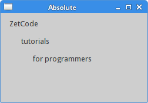

# Layout management in PyQt6
*last modified April 27, 2021*

Layout management is the way how we place the widgets on the application window. We can place our widgets using absolute positioning or with layout classes. Managing the layout with layout managers is the preferred way of organizing our widgets.

## Absolute positioning
The programmer specifies the position and the size of each widget in pixels. When you use absolute positioning, we have to understand the following limitations:

 - The size and the position of a widget do not change if we resize a window
 - Applications might look different on various platforms
 - Changing fonts in our application might spoil the layout
 - If we decide to change our layout, we must completely redo our layout, which is tedious and time consuming

The following example positions widgets in absolute coordinates.

``` python
# file: absolute.py
#!/usr/bin/python

"""
ZetCode PyQt6 tutorial

This example shows three labels on a window
using absolute positioning.

Author: Jan Bodnar
Website: zetcode.com
"""

import sys
from PyQt6.QtWidgets import QWidget, QLabel, QApplication


class Example(QWidget):

    def __init__(self):
        super().__init__()

        self.initUI()


    def initUI(self):

        lbl1 = QLabel('ZetCode', self)
        lbl1.move(15, 10)

        lbl2 = QLabel('tutorials', self)
        lbl2.move(35, 40)

        lbl3 = QLabel('for programmers', self)
        lbl3.move(55, 70)

        self.setGeometry(300, 300, 350, 250)
        self.setWindowTitle('Absolute')
        self.show()


def main():

    app = QApplication(sys.argv)
    ex = Example()
    sys.exit(app.exec())


if __name__ == '__main__':
    main()
```
We use the move method to position our widgets. In our case these are labels. We position them by providing the x and y coordinates. The beginning of the coordinate system is at the left top corner. The x values grow from left to right. The y values grow from top to bottom.

``` python
lbl1 = QLabel('ZetCode', self)
lbl1.move(15, 10)
The label widget is positioned at x=15 and y=10.
```



Figure: Absolute positioning

## PyQt6 QHBoxLayout
`QHBoxLayout` and `QVBoxLayout` are basic layout classes that line up widgets horizontally and vertically.

Imagine that we wanted to place two buttons in the right bottom corner. To create such a layout, we use one horizontal and one vertical box. To create the necessary space, we add a *stretch factor*.

``` python
# file: box_layout.py
#!/usr/bin/python

"""
ZetCode PyQt6 tutorial

In this example, we position two push
buttons in the bottom-right corner
of the window.

Author: Jan Bodnar
Website: zetcode.com
"""

import sys
from PyQt6.QtWidgets import (QWidget, QPushButton,
        QHBoxLayout, QVBoxLayout, QApplication)


class Example(QWidget):

    def __init__(self):
        super().__init__()

        self.initUI()


    def initUI(self):

        okButton = QPushButton("OK")
        cancelButton = QPushButton("Cancel")

        hbox = QHBoxLayout()
        hbox.addStretch(1)
        hbox.addWidget(okButton)
        hbox.addWidget(cancelButton)

        vbox = QVBoxLayout()
        vbox.addStretch(1)
        vbox.addLayout(hbox)

        self.setLayout(vbox)

        self.setGeometry(300, 300, 350, 250)
        self.setWindowTitle('Buttons')
        self.show()


def main():

    app = QApplication(sys.argv)
    ex = Example()
    sys.exit(app.exec())


if __name__ == '__main__':
    main()
```

The example places two buttons in the bottom-right corner of the window. They stay there when we resize the application window. We use both a `HBoxLayout` and a `QVBoxLayout`.
``` python
okButton = QPushButton("OK")
cancelButton = QPushButton("Cancel")
```
Here we create two push buttons.
``` python
hbox = QHBoxLayout()
hbox.addStretch(1)
hbox.addWidget(okButton)
hbox.addWidget(cancelButton)
```
We create a horizontal box layout and add a stretch factor and both buttons. The stretch adds a stretchable space before the two buttons. This will push them to the right of the window.
``` python
vbox = QVBoxLayout()
vbox.addStretch(1)
vbox.addLayout(hbox)
```
The horizontal layout is placed into the vertical layout. The stretch factor in the vertical box will push the horizontal box with the buttons to the bottom of the window.
``` python
self.setLayout(vbox)
```
Finally, we set the main layout of the window.


Figure: Buttons

## PyQt6 QGridLayout

`QGridLayout` is the most universal layout class. It divides the space into rows and columns.
``` python
# file: calculator.py
#!/usr/bin/python

"""
ZetCode PyQt6 tutorial

In this example, we create a skeleton
of a calculator using QGridLayout.

Author: Jan Bodnar
Website: zetcode.com
"""

import sys
from PyQt6.QtWidgets import (QWidget, QGridLayout,
        QPushButton, QApplication)


class Example(QWidget):

    def __init__(self):
        super().__init__()

        self.initUI()


    def initUI(self):

        grid = QGridLayout()
        self.setLayout(grid)

        names = ['Cls', 'Bck', '', 'Close',
                 '7', '8', '9', '/',
                 '4', '5', '6', '*',
                 '1', '2', '3', '-',
                 '0', '.', '=', '+']

        positions = [(i, j) for i in range(5) for j in range(4)]

        for position, name in zip(positions, names):

            if name == '':
                continue

            button = QPushButton(name)
            grid.addWidget(button, *position)

        self.move(300, 150)
        self.setWindowTitle('Calculator')
        self.show()


def main():

    app = QApplication(sys.argv)
    ex = Example()
    sys.exit(app.exec())


if __name__ == '__main__':
    main()
```
In our example, we create a grid of buttons.
``` python
grid = QGridLayout()
self.setLayout(grid)
```
The instance of a `QGridLayout` is created and set to be the layout for the application window.
``` python
names = ['Cls', 'Bck', '', 'Close',
            '7', '8', '9', '/',
        '4', '5', '6', '*',
            '1', '2', '3', '-',
        '0', '.', '=', '+']
```
These are the labels used later for buttons.
``` python
positions = [(i,j) for i in range(5) for j in range(4)]
```
We create a list of positions in the grid.
``` python
for position, name in zip(positions, names):

    if name == '':
        continue
        
    button = QPushButton(name)
    grid.addWidget(button, *position)
```
Buttons are created and added to the layout with the `addWidget` method.


Figure: Calculator skeleton

## Review example
Widgets can span multiple columns or rows in a grid. In the next example we illustrate this.

``` python
# file: review.py
#!/usr/bin/python

"""
ZetCode PyQt6 tutorial

In this example, we create a bit
more complicated window layout using
the QGridLayout manager.

Author: Jan Bodnar
Website: zetcode.com
"""

import sys
from PyQt6.QtWidgets import (QWidget, QLabel, QLineEdit,
        QTextEdit, QGridLayout, QApplication)


class Example(QWidget):

    def __init__(self):
        super().__init__()

        self.initUI()


    def initUI(self):

        title = QLabel('Title')
        author = QLabel('Author')
        review = QLabel('Review')

        titleEdit = QLineEdit()
        authorEdit = QLineEdit()
        reviewEdit = QTextEdit()

        grid = QGridLayout()
        grid.setSpacing(10)

        grid.addWidget(title, 1, 0)
        grid.addWidget(titleEdit, 1, 1)

        grid.addWidget(author, 2, 0)
        grid.addWidget(authorEdit, 2, 1)

        grid.addWidget(review, 3, 0)
        grid.addWidget(reviewEdit, 3, 1, 5, 1)

        self.setLayout(grid)

        self.setGeometry(300, 300, 350, 300)
        self.setWindowTitle('Review')
        self.show()


def main():

    app = QApplication(sys.argv)
    ex = Example()
    sys.exit(app.exec())


if __name__ == '__main__':
    main()
```
We create a window in which we have three labels, two line edits and one text edit widget. The layout is done with the `QGridLayout`.

``` python
grid = QGridLayout()
grid.setSpacing(10)
```

We create a grid layout and set spacing between widgets.

``` python
grid.addWidget(reviewEdit, 3, 1, 5, 1)
```

If we add a widget to a grid, we can provide row span and column span of the widget. In our case, we make the `reviewEdit` widget span 5 rows.


Figure: Review example

This part of the PyQt6 tutorial was dedicated to layout management.