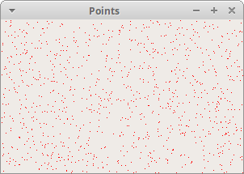
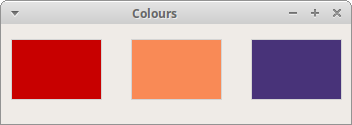
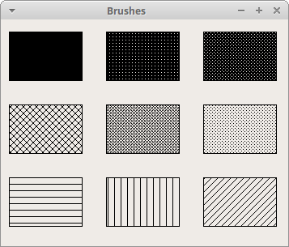

# Painting in PyQt6
*last modified May 15, 2021*

PyQt6 painting system is able to render vector graphics, images, and outline font-based text. Painting is needed in applications when we want to change or enhance an existing widget, or if we are creating a custom widget from scratch. To do the drawing, we use the painting API provided by the PyQt6 toolkit.

## QPainter
QPainter performs low-level painting on widgets and other paint devices. It can draw everything from simple lines to complex shapes.

## The paintEvent method
The painting is done within the paintEvent method. The painting code is placed between the begin and end methods of the QPainter object. It performs low-level painting on widgets and other paint devices.

## PyQt6 draw text
We begin with drawing some Unicode text on the client area of a window.

``` python
# file: draw_text.py
#!/usr/bin/python

"""
ZetCode PyQt6 tutorial

In this example, we draw text in Russian Cylliric.

Author: Jan Bodnar
Website: zetcode.com
"""

import sys
from PyQt6.QtWidgets import QWidget, QApplication
from PyQt6.QtGui import QPainter, QColor, QFont
from PyQt6.QtCore import Qt


class Example(QWidget):

    def __init__(self):
        super().__init__()

        self.initUI()


    def initUI(self):

        self.text = "Лев Николаевич Толстой\nАнна Каренина"

        self.setGeometry(300, 300, 350, 300)
        self.setWindowTitle('Drawing text')
        self.show()


    def paintEvent(self, event):

        qp = QPainter()
        qp.begin(self)
        self.drawText(event, qp)
        qp.end()


    def drawText(self, event, qp):

        qp.setPen(QColor(168, 34, 3))
        qp.setFont(QFont('Decorative', 10))
        qp.drawText(event.rect(), Qt.Alignment.AlignCenter, self.text)


def main():

    app = QApplication(sys.argv)
    ex = Example()
    sys.exit(app.exec())


if __name__ == '__main__':
    main()
```
In our example, we draw some text in Cylliric. The text is vertically and horizontally aligned.

``` python
def paintEvent(self, event):
...
```
Drawing is done within the paint event.

``` python
qp = QPainter()
qp.begin(self)
self.drawText(event, qp)
qp.end()
```
The `QPainter` class is responsible for all the low-level painting. All the painting methods go between begin and end methods. The actual painting is delegated to the drawText method.
``` python
qp.setPen(QColor(168, 34, 3))
qp.setFont(QFont('Decorative', 10))
```
Here we define a pen and a font which are used to draw the text.

``` python
qp.drawText(event.rect(), Qt.Alignment.AlignCenter, self.text)
```
The drawText method draws text on the window. The rect method of the paint event returns the rectangle that needs to be updated. With the `Qt.Alignment.AlignCenter` we align the text in both dimensions.


Figure: Drawing text

## PyQt6 draw points
A point is the most simple graphics object that can be drawn. It is a small spot on the window.

``` python
# file: draw_points.py
#!/usr/bin/python

"""
ZetCode PyQt6 tutorial

In the example, we draw randomly 1000 red points
on the window.

Author: Jan Bodnar
Website: zetcode.com
"""

from PyQt6.QtWidgets import QWidget, QApplication
from PyQt6.QtGui import QPainter
from PyQt6.QtCore import Qt
import sys, random


class Example(QWidget):

    def __init__(self):
        super().__init__()

        self.initUI()


    def initUI(self):

        self.setMinimumSize(50, 50)
        self.setGeometry(300, 300, 350, 300)
        self.setWindowTitle('Points')
        self.show()


    def paintEvent(self, e):

        qp = QPainter()
        qp.begin(self)
        self.drawPoints(qp)
        qp.end()


    def drawPoints(self, qp):

        qp.setPen(Qt.GlobalColor.red)
        size = self.size()

        for i in range(1000):

            x = random.randint(1, size.width() - 1)
            y = random.randint(1, size.height() - 1)
            qp.drawPoint(x, y)


def main():

    app = QApplication(sys.argv)
    ex = Example()
    sys.exit(app.exec())


if __name__ == '__main__':
    main()
```
In our example, we draw randomly 1000 red points on the client area of the window.

``` python
qp.setPen(Qt.GlobalColor.red)
```
We set the pen to red colour. We use a predefined `Qt.GlobalColor.red` colour constant.

``` python
size = self.size()
```
Each time we resize the window, a paint event is generated. We get the current size of the window with the size method. We use the size of the window to distribute the points all over the client area of the window.

``` python
qp.drawPoint(x, y)
```
We draw the point with the drawPoint method.



Figure: Points

## PyQt6 colours

A colour is an object representing a combination of Red, Green, and Blue (RGB) intensity values. Valid RGB values are in the range from 0 to 255. We can define a colour in various ways. The most common are RGB decimal values or hexadecimal values. We can also use an RGBA value which stands for Red, Green, Blue, and Alpha. Here we add some extra information regarding transparency. Alpha value of 255 defines full opacity, 0 is for full transparency, e.g. the colour is invisible.

``` python
# file: colours.py
#!/usr/bin/python

"""
ZetCode PyQt6 tutorial

This example draws three rectangles in three
different colours.

Author: Jan Bodnar
Website: zetcode.com
"""

from PyQt6.QtWidgets import QWidget, QApplication
from PyQt6.QtGui import QPainter, QColor
import sys


class Example(QWidget):

    def __init__(self):
        super().__init__()

        self.initUI()


    def initUI(self):

        self.setGeometry(300, 300, 350, 100)
        self.setWindowTitle('Colours')
        self.show()


    def paintEvent(self, e):

        qp = QPainter()
        qp.begin(self)
        self.drawRectangles(qp)
        qp.end()


    def drawRectangles(self, qp):

        col = QColor(0, 0, 0)
        col.setNamedColor('#d4d4d4')
        qp.setPen(col)

        qp.setBrush(QColor(200, 0, 0))
        qp.drawRect(10, 15, 90, 60)

        qp.setBrush(QColor(255, 80, 0, 160))
        qp.drawRect(130, 15, 90, 60)

        qp.setBrush(QColor(25, 0, 90, 200))
        qp.drawRect(250, 15, 90, 60)


def main():

    app = QApplication(sys.argv)
    ex = Example()
    sys.exit(app.exec())


if __name__ == '__main__':
    main()
```
In our example, we draw three coloured rectangles.

``` python
color = QColor(0, 0, 0)
color.setNamedColor('#d4d4d4')
```
Here we define a colour using a hexadecimal notation.

``` python
qp.setBrush(QColor(200, 0, 0))
qp.drawRect(10, 15, 90, 60)
```
Here we define a brush and draw a rectangle. A *brush* is an elementary graphics object which is used to draw the background of a shape. The `drawRect` method accepts four parameters. The first two are x and y values on the axis. The third and fourth parameters are the width and height of the rectangle. The method draws the rectangle using the current pen and brush.



Figure: Colours

## PyQt6 QPen
The `QPen` is an elementary graphics object. It is used to draw lines, curves and outlines of rectangles, ellipses, polygons, or other shapes.

``` python
# file: pens.py
#!/usr/bin/python

"""
ZetCode PyQt6 tutorial

In this example we draw 6 lines using
different pen styles.

Author: Jan Bodnar
Website: zetcode.com
"""

from PyQt6.QtWidgets import QWidget, QApplication
from PyQt6.QtGui import QPainter, QPen
from PyQt6.QtCore import Qt
import sys


class Example(QWidget):

    def __init__(self):
        super().__init__()

        self.initUI()


    def initUI(self):

        self.setGeometry(300, 300, 280, 270)
        self.setWindowTitle('Pen styles')
        self.show()


    def paintEvent(self, e):

        qp = QPainter()
        qp.begin(self)
        self.drawLines(qp)
        qp.end()


    def drawLines(self, qp):

        pen = QPen(Qt.GlobalColor.black, 2, Qt.PenStyle.SolidLine)

        qp.setPen(pen)
        qp.drawLine(20, 40, 250, 40)

        pen.setStyle(Qt.PenStyle.DashLine)
        qp.setPen(pen)
        qp.drawLine(20, 80, 250, 80)

        pen.setStyle(Qt.PenStyle.DashDotLine)
        qp.setPen(pen)
        qp.drawLine(20, 120, 250, 120)

        pen.setStyle(Qt.PenStyle.DotLine)
        qp.setPen(pen)
        qp.drawLine(20, 160, 250, 160)

        pen.setStyle(Qt.PenStyle.DashDotDotLine)
        qp.setPen(pen)
        qp.drawLine(20, 200, 250, 200)

        pen.setStyle(Qt.PenStyle.CustomDashLine)
        pen.setDashPattern([1, 4, 5, 4])
        qp.setPen(pen)
        qp.drawLine(20, 240, 250, 240)


def main():
    
    app = QApplication(sys.argv)
    ex = Example()
    sys.exit(app.exec())


if __name__ == '__main__':
    main()
```

In our example, we draw six lines. The lines are drawn in six different pen styles. There are five predefined pen styles. We can create also custom pen styles. The last line is drawn using a custom pen style.

``` python
pen = QPen(Qt.GlobalColor.black, 2, Qt.PenStyle.SolidLine)
```
We create a `QPen` object. The colour is black. The width is set to 2 pixels so that we can see the differences between the pen styles. `Qt.SolidLine` is one of the predefined pen styles.

``` python
pen.setStyle(Qt.PenStyle.CustomDashLine)
pen.setDashPattern([1, 4, 5, 4])
qp.setPen(pen)
```
Here we define a custom pen style. We set a `Qt.PenStyle.CustomDashLine` pen style and call the `setDashPattern` method. The list of numbers defines a style. There must be an even number of numbers. Odd numbers define a dash, even numbers space. The greater the number, the greater the space or the dash. Our pattern is 1 px dash, 4 px space, 5 px dash, 4 px space etc.


Figure: Pen styles

## PyQt6 QBrush
`QBrush` is an elementary graphics object. It is used to paint the background of graphics shapes, such as rectangles, ellipses, or polygons. A brush can be of three different types: a predefined brush, a gradient, or a texture pattern.

``` python
# file: brushes.py
#!/usr/bin/python

"""
ZetCode PyQt6 tutorial

This example draws nine rectangles in different
brush styles.

Author: Jan Bodnar
Website: zetcode.com
"""

from PyQt6.QtWidgets import QWidget, QApplication
from PyQt6.QtGui import QPainter, QBrush
from PyQt6.QtCore import Qt
import sys


class Example(QWidget):

    def __init__(self):
        super().__init__()

        self.initUI()


    def initUI(self):

        self.setGeometry(300, 300, 355, 280)
        self.setWindowTitle('Brushes')
        self.show()


    def paintEvent(self, e):

        qp = QPainter()
        qp.begin(self)
        self.drawBrushes(qp)
        qp.end()


    def drawBrushes(self, qp):

        brush = QBrush(Qt.BrushStyle.SolidPattern)
        qp.setBrush(brush)
        qp.drawRect(10, 15, 90, 60)

        brush.setStyle(Qt.BrushStyle.Dense1Pattern)
        qp.setBrush(brush)
        qp.drawRect(130, 15, 90, 60)

        brush.setStyle(Qt.BrushStyle.Dense2Pattern)
        qp.setBrush(brush)
        qp.drawRect(250, 15, 90, 60)

        brush.setStyle(Qt.BrushStyle.DiagCrossPattern)
        qp.setBrush(brush)
        qp.drawRect(10, 105, 90, 60)

        brush.setStyle(Qt.BrushStyle.Dense5Pattern)
        qp.setBrush(brush)
        qp.drawRect(130, 105, 90, 60)

        brush.setStyle(Qt.BrushStyle.Dense6Pattern)
        qp.setBrush(brush)
        qp.drawRect(250, 105, 90, 60)

        brush.setStyle(Qt.BrushStyle.HorPattern)
        qp.setBrush(brush)
        qp.drawRect(10, 195, 90, 60)

        brush.setStyle(Qt.BrushStyle.VerPattern)
        qp.setBrush(brush)
        qp.drawRect(130, 195, 90, 60)

        brush.setStyle(Qt.BrushStyle.BDiagPattern)
        qp.setBrush(brush)
        qp.drawRect(250, 195, 90, 60)


def main():

    app = QApplication(sys.argv)
    ex = Example()
    sys.exit(app.exec())


if __name__ == '__main__':
    main()
```
In our example, we draw nine different rectangles.

``` python
brush = QBrush(Qt.BrushStyle.SolidPattern)
qp.setBrush(brush)
qp.drawRect(10, 15, 90, 60)
```
We define a brush object. We set it to the painter object and draw the rectangle by calling the drawRect method.



Figure: Brushes

## Bézier curve
Bézier curve is a cubic line. Bézier curve in PyQt6 can be created with `QPainterPath`. A painter path is an object composed of a number of graphical building blocks, such as rectangles, ellipses, lines, and curves.

``` python
# file: bezier_curve.py
#!/usr/bin/python

"""
ZetCode PyQt6 tutorial

This program draws a Bézier curve with
QPainterPath.

Author: Jan Bodnar
Website: zetcode.com
"""

import sys

from PyQt6.QtGui import QPainter, QPainterPath
from PyQt6.QtWidgets import QWidget, QApplication


class Example(QWidget):

    def __init__(self):
        super().__init__()

        self.initUI()


    def initUI(self):

        self.setGeometry(300, 300, 380, 250)
        self.setWindowTitle('Bézier curve')
        self.show()


    def paintEvent(self, e):

        qp = QPainter()
        qp.begin(self)
        qp.setRenderHint(QPainter.RenderHints.Antialiasing)
        self.drawBezierCurve(qp)
        qp.end()


    def drawBezierCurve(self, qp):
    
        path = QPainterPath()
        path.moveTo(30, 30)
        path.cubicTo(30, 30, 200, 350, 350, 30)

        qp.drawPath(path)


def main():

    app = QApplication(sys.argv)
    ex = Example()
    sys.exit(app.exec())


if __name__ == '__main__':
    main()
```
This example draws a Bézier curve.

```python
path = QPainterPath()
path.moveTo(30, 30)
path.cubicTo(30, 30, 200, 350, 350, 30)
```
We create a Bézier curve with `QPainterPath` path. The curve is created with `cubicTo` method, which takes three points: starting point, control point, and ending point.

``` python
qp.drawPath(path)
```
The final path is drawn with drawPath method.


Figure: Bézier curve

In this part of the PyQt6 tutorial, we did some basic painting.