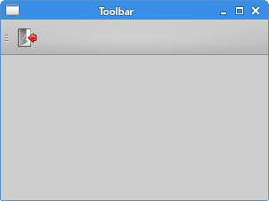
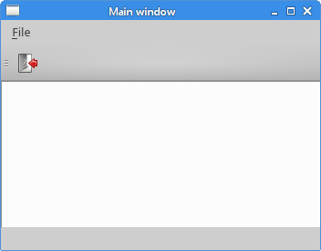

# 菜单和工具栏

这个章节，我们会创建状态栏、菜单和工具栏。菜单是一组位于菜单栏的命令。工具栏是应用的一些常用工具按钮。状态栏显示一些状态信息，通常在应用的底部。

## 主窗口

`QMainWindow`提供了主窗口的功能，使用它能创建一些简单的状态栏、工具栏和菜单栏。

主窗口是下面这些窗口的合称，所以教程在最下方。

## 状态栏

状态栏是用来显示应用的状态信息的组件。

```python
#!/usr/bin/python3
# -*- coding: utf-8 -*-

"""
ZetCode PyQt5 tutorial 

This program creates a statusbar.

Author: Jan Bodnar
Website: zetcode.com 
Last edited: August 2017
"""

import sys
from PyQt5.QtWidgets import QMainWindow, QApplication


class Example(QMainWindow):

    def __init__(self):
        super().__init__()

        self.initUI()


    def initUI(self):               

        self.statusBar().showMessage('Ready')

        self.setGeometry(300, 300, 250, 150)
        self.setWindowTitle('Statusbar')    
        self.show()


if __name__ == '__main__':

    app = QApplication(sys.argv)
    ex = Example()
    sys.exit(app.exec_())
```

状态栏是由QMainWindow创建的。

```text
self.statusBar().showMessage('Ready')
```

调用`QtGui.QMainWindow`类的`statusBar()`方法，创建状态栏。第一次调用会创建一个状态栏，而再次调用会返回一个状态栏对象。`showMessage()`方法在状态栏上显示一条信息。

程序预览： 

## 菜单栏

菜单栏是非常常用的。是一组命令的集合（Mac OS下状态栏的显示不一样，为得到最相似的外观，我们可以增加一行语句`menubar.setNativeMenuBar(False)`\)。

```python
#!/usr/bin/python3
# -*- coding: utf-8 -*-

"""
ZetCode PyQt5 tutorial 

This program creates a menubar. The
menubar has one menu with an exit action.

Author: Jan Bodnar
Website: zetcode.com 
Last edited: January 2017
"""

import sys
from PyQt5.QtWidgets import QMainWindow, QAction, qApp, QApplication
from PyQt5.QtGui import QIcon


class Example(QMainWindow):

    def __init__(self):
        super().__init__()

        self.initUI()


    def initUI(self):               

        exitAct = QAction(QIcon('exit.png'), '&Exit', self)        
        exitAct.setShortcut('Ctrl+Q')
        exitAct.setStatusTip('Exit application')
        exitAct.triggered.connect(qApp.quit)

        self.statusBar()

        menubar = self.menuBar()
        fileMenu = menubar.addMenu('&File')
        fileMenu.addAction(exitAct)

        self.setGeometry(300, 300, 300, 200)
        self.setWindowTitle('Simple menu')    
        self.show()


if __name__ == '__main__':

    app = QApplication(sys.argv)
    ex = Example()
    sys.exit(app.exec_())
```

在上面的示例中，我们创建了只有一个命令的菜单栏，这个命令就是终止应用。同时也创建了一个状态栏。而且还能使用快捷键`Ctrl+Q`退出应用。

```text
exitAct = QAction(QIcon('exit.png'), '&Exit', self)        
exitAct.setShortcut('Ctrl+Q')
exitAct.setStatusTip('Exit application')
```

`QAction`是菜单栏、工具栏或者快捷键的动作的组合。上面三行中，前两行创建了一个图标、一个exit的标签和一个快捷键组合，都执行了一个动作；第三行，创建了一个状态栏，当鼠标悬停在菜单栏的时候，能显示当前状态。

```text
exitAct.triggered.connect(qApp.quit)
```

当执行这个指定的动作时，就触发了一个事件。这个事件跟`QApplication的quit()`行为相关联，所以这个动作就能终止这个应用。

```text
menubar = self.menuBar()
fileMenu = menubar.addMenu('&File')
fileMenu.addAction(exitAct)
```

`menuBar()`创建菜单栏。这里创建了一个菜单栏，并用`addMenu()`在上面添加了一个file菜单，用`addAction()`关联了点击退出应用的事件。

程序预览： 

## 子菜单

子菜单是嵌套在菜单里面的二级或者三级等的菜单。

```python
#!/usr/bin/python3
# -*- coding: utf-8 -*-

"""
ZetCode PyQt5 tutorial 

This program creates a submenu.

Author: Jan Bodnar
Website: zetcode.com 
Last edited: August 2017
"""

import sys
from PyQt5.QtWidgets import QMainWindow, QAction, QMenu, QApplication

class Example(QMainWindow):

    def __init__(self):
        super().__init__()

        self.initUI()


    def initUI(self):         

        menubar = self.menuBar()
        fileMenu = menubar.addMenu('File')

        impMenu = QMenu('Import', self)
        impAct = QAction('Import mail', self) 
        impMenu.addAction(impAct)

        newAct = QAction('New', self)        

        fileMenu.addAction(newAct)
        fileMenu.addMenu(impMenu)

        self.setGeometry(300, 300, 300, 200)
        self.setWindowTitle('Submenu')    
        self.show()


if __name__ == '__main__':

    app = QApplication(sys.argv)
    ex = Example()
    sys.exit(app.exec_())
```

这个例子里，有两个子菜单，一个在File菜单下面，一个在File的Import下面。

```text
impMenu = QMenu('Import', self)
```

使用`QMenu`创建一个新菜单。

```text
impAct = QAction('Import mail', self) 
impMenu.addAction(impAct)
```

使用`addAction()`添加一个动作。

程序预览： 

## 勾选菜单

下面是一个勾选菜单的例子

```python
#!/usr/bin/python3
# -*- coding: utf-8 -*-

"""
ZetCode PyQt5 tutorial 

This program creates a checkable menu.

Author: Jan Bodnar
Website: zetcode.com 
Last edited: August 2017
"""

import sys
from PyQt5.QtWidgets import QMainWindow, QAction, QApplication

class Example(QMainWindow):

    def __init__(self):
        super().__init__()

        self.initUI()


    def initUI(self):         

        self.statusbar = self.statusBar()
        self.statusbar.showMessage('Ready')

        menubar = self.menuBar()
        viewMenu = menubar.addMenu('View')

        viewStatAct = QAction('View statusbar', self, checkable=True)
        viewStatAct.setStatusTip('View statusbar')
        viewStatAct.setChecked(True)
        viewStatAct.triggered.connect(self.toggleMenu)

        viewMenu.addAction(viewStatAct)

        self.setGeometry(300, 300, 300, 200)
        self.setWindowTitle('Check menu')    
        self.show()

    def toggleMenu(self, state):

        if state:
            self.statusbar.show()
        else:
            self.statusbar.hide()


if __name__ == '__main__':

    app = QApplication(sys.argv)
    ex = Example()
    sys.exit(app.exec_())
```

本例创建了一个行为菜单。这个行为／动作能切换状态栏显示或者隐藏。

```text
viewStatAct = QAction('View statusbar', self, checkable=True)
```

用`checkable`选项创建一个能选中的菜单。

```text
viewStatAct.setChecked(True)
```

默认设置为选中状态。

```text
def toggleMenu(self, state):

    if state:
        self.statusbar.show()
    else:
        self.statusbar.hide()
```

依据选中状态切换状态栏的显示与否。 程序预览：


## 右键菜单

右键菜单也叫弹出框（！？），是在某些场合下显示的一组命令。例如，Opera浏览器里，网页上的右键菜单里会有刷新，返回或者查看页面源代码。如果在工具栏上右键，会得到一个不同的用来管理工具栏的菜单。

```python
#!/usr/bin/python3
# -*- coding: utf-8 -*-

"""
ZetCode PyQt5 tutorial 

This program creates a context menu.

Author: Jan Bodnar
Website: zetcode.com 
Last edited: August 2017
"""

import sys
from PyQt5.QtWidgets import QMainWindow, qApp, QMenu, QApplication

class Example(QMainWindow):

    def __init__(self):
        super().__init__()

        self.initUI()


    def initUI(self):         

        self.setGeometry(300, 300, 300, 200)
        self.setWindowTitle('Context menu')    
        self.show()


    def contextMenuEvent(self, event):

           cmenu = QMenu(self)

           newAct = cmenu.addAction("New")
           opnAct = cmenu.addAction("Open")
           quitAct = cmenu.addAction("Quit")
           action = cmenu.exec_(self.mapToGlobal(event.pos()))

           if action == quitAct:
               qApp.quit()


if __name__ == '__main__':

    app = QApplication(sys.argv)
    ex = Example()
    sys.exit(app.exec_())
```

还是使用`contextMenuEvent()`方法实现这个菜单。

```text
action = cmenu.exec_(self.mapToGlobal(event.pos()))
```

使用`exec_()`方法显示菜单。从鼠标右键事件对象中获得当前坐标。`mapToGlobal()`方法把当前组件的相对坐标转换为窗口（window）的绝对坐标。

```text
if action == quitAct:
    qApp.quit()
```

如果右键菜单里触发了事件，也就触发了退出事件，执行关闭菜单行为。

程序预览：


## 工具栏

菜单栏包含了所有的命令，工具栏就是常用的命令的集合。

```python
#!/usr/bin/python3
# -*- coding: utf-8 -*-

"""
ZetCode PyQt5 tutorial 

This program creates a toolbar.
The toolbar has one action, which
terminates the application, if triggered.

Author: Jan Bodnar
Website: zetcode.com 
Last edited: August 2017
"""

import sys
from PyQt5.QtWidgets import QMainWindow, QAction, qApp, QApplication
from PyQt5.QtGui import QIcon

class Example(QMainWindow):

    def __init__(self):
        super().__init__()

        self.initUI()


    def initUI(self):               

        exitAct = QAction(QIcon('exit24.png'), 'Exit', self)
        exitAct.setShortcut('Ctrl+Q')
        exitAct.triggered.connect(qApp.quit)

        self.toolbar = self.addToolBar('Exit')
        self.toolbar.addAction(exitAct)

        self.setGeometry(300, 300, 300, 200)
        self.setWindowTitle('Toolbar')    
        self.show()


if __name__ == '__main__':

    app = QApplication(sys.argv)
    ex = Example()
    sys.exit(app.exec_())
```

上面的例子中，我们创建了一个工具栏。这个工具栏只有一个退出应用的动作。

```text
exitAct = QAction(QIcon('exit24.png'), 'Exit', self)
exitAct.setShortcut('Ctrl+Q')
exitAct.triggered.connect(qApp.quit)
```

和上面的菜单栏差不多，这里使用了一个行为对象，这个对象绑定了一个标签，一个图标和一个快捷键。这些行为被触发的时候，会调用`QtGui.QMainWindow`的quit方法退出应用。

```text
self.toolbar = self.addToolBar('Exit')
self.toolbar.addAction(exitAct)
```

用`addToolBar()`创建工具栏，并用`addAction()`将动作对象添加到工具栏。

程序预览：



## 主窗口

主窗口就是上面三种栏目的总称，现在我们把上面的三种栏在一个应用里展示出来。

> 首先要自己弄个小图标，命名为exit24.png

```python
#!/usr/bin/python3
# -*- coding: utf-8 -*-

"""
ZetCode PyQt5 tutorial 

This program creates a skeleton of
a classic GUI application with a menubar,
toolbar, statusbar, and a central widget. 

Author: Jan Bodnar
Website: zetcode.com 
Last edited: August 2017
"""

import sys
from PyQt5.QtWidgets import QMainWindow, QTextEdit, QAction, QApplication
from PyQt5.QtGui import QIcon


class Example(QMainWindow):

    def __init__(self):
        super().__init__()

        self.initUI()


    def initUI(self):               

        textEdit = QTextEdit()
        self.setCentralWidget(textEdit)

        exitAct = QAction(QIcon('exit24.png'), 'Exit', self)
        exitAct.setShortcut('Ctrl+Q')
        exitAct.setStatusTip('Exit application')
        exitAct.triggered.connect(self.close)

        self.statusBar()

        menubar = self.menuBar()
        fileMenu = menubar.addMenu('&File')
        fileMenu.addAction(exitAct)

        toolbar = self.addToolBar('Exit')
        toolbar.addAction(exitAct)

        self.setGeometry(300, 300, 350, 250)
        self.setWindowTitle('Main window')    
        self.show()


if __name__ == '__main__':

    app = QApplication(sys.argv)
    ex = Example()
    sys.exit(app.exec_())
```

上面的代码创建了一个很经典的菜单框架，有右键菜单，工具栏和状态栏。

```text
textEdit = QTextEdit()
self.setCentralWidget(textEdit)
```

这里创建了一个文本编辑区域，并把它放在`QMainWindow`的中间区域。这个组件会占满所有剩余的区域。

程序预览：



