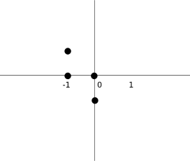
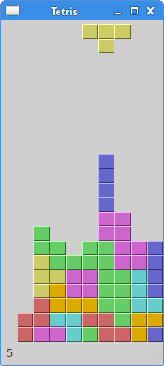

# 俄罗斯方块游戏

本章我们要制作一个俄罗斯方块游戏。

## Tetris

> 译注：称呼：方块是由四个小方格组成的

俄罗斯方块游戏是世界上最流行的游戏之一。是由一名叫Alexey Pajitnov的俄罗斯程序员在1985年制作的，从那时起，这个游戏就风靡了各个游戏平台。

俄罗斯方块归类为下落块迷宫游戏。游戏有7个基本形状：S、Z、T、L、反向L、直线、方块，每个形状都由4个方块组成，方块最终都会落到屏幕底部。所以玩家通过控制形状的左右位置和旋转，让每个形状都以合适的位置落下，如果有一行全部被方块填充，这行就会消失，并且得分。游戏结束的条件是有形状接触到了屏幕顶部。

方块展示：


PyQt5是专门为创建图形界面产生的，里面一些专门为制作游戏而开发的组件，所以PyQt5是能制作小游戏的。

制作电脑游戏也是提高自己编程能力的一种很好的方式。

## 开发

没有图片，所以就自己用绘画画出来几个图形。每个游戏里都有数学模型的，这个也是。

开工之前：

* 用`QtCore.QBasicTimer()`创建一个游戏循环
* 模型是一直下落的
* 模型的运动是以小块为基础单位的，不是按像素
* 从数学意义上来说，模型就是就是一串数字而已

代码由四个类组成：Tetris, Board, Tetrominoe和Shape。Tetris类创建游戏，Board是游戏主要逻辑。Tetrominoe包含了所有的砖块，Shape是所有砖块的代码。

```python
#!/usr/bin/python3
# -*- coding: utf-8 -*-

"""
ZetCode PyQt5 tutorial 

This is a Tetris game clone.

Author: Jan Bodnar
Website: zetcode.com 
Last edited: August 2017
"""

from PyQt5.QtWidgets import QMainWindow, QFrame, QDesktopWidget, QApplication
from PyQt5.QtCore import Qt, QBasicTimer, pyqtSignal
from PyQt5.QtGui import QPainter, QColor 
import sys, random

class Tetris(QMainWindow):

    def __init__(self):
        super().__init__()

        self.initUI()


    def initUI(self):    
        '''initiates application UI'''

        self.tboard = Board(self)
        self.setCentralWidget(self.tboard)

        self.statusbar = self.statusBar()        
        self.tboard.msg2Statusbar[str].connect(self.statusbar.showMessage)

        self.tboard.start()

        self.resize(180, 380)
        self.center()
        self.setWindowTitle('Tetris')        
        self.show()


    def center(self):
        '''centers the window on the screen'''

        screen = QDesktopWidget().screenGeometry()
        size = self.geometry()
        self.move((screen.width()-size.width())/2, 
            (screen.height()-size.height())/2)


class Board(QFrame):

    msg2Statusbar = pyqtSignal(str)

    BoardWidth = 10
    BoardHeight = 22
    Speed = 300

    def __init__(self, parent):
        super().__init__(parent)

        self.initBoard()


    def initBoard(self):     
        '''initiates board'''

        self.timer = QBasicTimer()
        self.isWaitingAfterLine = False

        self.curX = 0
        self.curY = 0
        self.numLinesRemoved = 0
        self.board = []

        self.setFocusPolicy(Qt.StrongFocus)
        self.isStarted = False
        self.isPaused = False
        self.clearBoard()


    def shapeAt(self, x, y):
        '''determines shape at the board position'''

        return self.board[(y * Board.BoardWidth) + x]


    def setShapeAt(self, x, y, shape):
        '''sets a shape at the board'''

        self.board[(y * Board.BoardWidth) + x] = shape


    def squareWidth(self):
        '''returns the width of one square'''

        return self.contentsRect().width() // Board.BoardWidth


    def squareHeight(self):
        '''returns the height of one square'''

        return self.contentsRect().height() // Board.BoardHeight


    def start(self):
        '''starts game'''

        if self.isPaused:
            return

        self.isStarted = True
        self.isWaitingAfterLine = False
        self.numLinesRemoved = 0
        self.clearBoard()

        self.msg2Statusbar.emit(str(self.numLinesRemoved))

        self.newPiece()
        self.timer.start(Board.Speed, self)


    def pause(self):
        '''pauses game'''

        if not self.isStarted:
            return

        self.isPaused = not self.isPaused

        if self.isPaused:
            self.timer.stop()
            self.msg2Statusbar.emit("paused")

        else:
            self.timer.start(Board.Speed, self)
            self.msg2Statusbar.emit(str(self.numLinesRemoved))

        self.update()


    def paintEvent(self, event):
        '''paints all shapes of the game'''

        painter = QPainter(self)
        rect = self.contentsRect()

        boardTop = rect.bottom() - Board.BoardHeight * self.squareHeight()

        for i in range(Board.BoardHeight):
            for j in range(Board.BoardWidth):
                shape = self.shapeAt(j, Board.BoardHeight - i - 1)

                if shape != Tetrominoe.NoShape:
                    self.drawSquare(painter,
                        rect.left() + j * self.squareWidth(),
                        boardTop + i * self.squareHeight(), shape)

        if self.curPiece.shape() != Tetrominoe.NoShape:

            for i in range(4):

                x = self.curX + self.curPiece.x(i)
                y = self.curY - self.curPiece.y(i)
                self.drawSquare(painter, rect.left() + x * self.squareWidth(),
                    boardTop + (Board.BoardHeight - y - 1) * self.squareHeight(),
                    self.curPiece.shape())


    def keyPressEvent(self, event):
        '''processes key press events'''

        if not self.isStarted or self.curPiece.shape() == Tetrominoe.NoShape:
            super(Board, self).keyPressEvent(event)
            return

        key = event.key()

        if key == Qt.Key_P:
            self.pause()
            return

        if self.isPaused:
            return

        elif key == Qt.Key_Left:
            self.tryMove(self.curPiece, self.curX - 1, self.curY)

        elif key == Qt.Key_Right:
            self.tryMove(self.curPiece, self.curX + 1, self.curY)

        elif key == Qt.Key_Down:
            self.tryMove(self.curPiece.rotateRight(), self.curX, self.curY)

        elif key == Qt.Key_Up:
            self.tryMove(self.curPiece.rotateLeft(), self.curX, self.curY)

        elif key == Qt.Key_Space:
            self.dropDown()

        elif key == Qt.Key_D:
            self.oneLineDown()

        else:
            super(Board, self).keyPressEvent(event)


    def timerEvent(self, event):
        '''handles timer event'''

        if event.timerId() == self.timer.timerId():

            if self.isWaitingAfterLine:
                self.isWaitingAfterLine = False
                self.newPiece()
            else:
                self.oneLineDown()

        else:
            super(Board, self).timerEvent(event)


    def clearBoard(self):
        '''clears shapes from the board'''

        for i in range(Board.BoardHeight * Board.BoardWidth):
            self.board.append(Tetrominoe.NoShape)


    def dropDown(self):
        '''drops down a shape'''

        newY = self.curY

        while newY > 0:

            if not self.tryMove(self.curPiece, self.curX, newY - 1):
                break

            newY -= 1

        self.pieceDropped()


    def oneLineDown(self):
        '''goes one line down with a shape'''

        if not self.tryMove(self.curPiece, self.curX, self.curY - 1):
            self.pieceDropped()


    def pieceDropped(self):
        '''after dropping shape, remove full lines and create new shape'''

        for i in range(4):

            x = self.curX + self.curPiece.x(i)
            y = self.curY - self.curPiece.y(i)
            self.setShapeAt(x, y, self.curPiece.shape())

        self.removeFullLines()

        if not self.isWaitingAfterLine:
            self.newPiece()


    def removeFullLines(self):
        '''removes all full lines from the board'''

        numFullLines = 0
        rowsToRemove = []

        for i in range(Board.BoardHeight):

            n = 0
            for j in range(Board.BoardWidth):
                if not self.shapeAt(j, i) == Tetrominoe.NoShape:
                    n = n + 1

            if n == 10:
                rowsToRemove.append(i)

        rowsToRemove.reverse()


        for m in rowsToRemove:

            for k in range(m, Board.BoardHeight):
                for l in range(Board.BoardWidth):
                        self.setShapeAt(l, k, self.shapeAt(l, k + 1))

        numFullLines = numFullLines + len(rowsToRemove)

        if numFullLines > 0:

            self.numLinesRemoved = self.numLinesRemoved + numFullLines
            self.msg2Statusbar.emit(str(self.numLinesRemoved))

            self.isWaitingAfterLine = True
            self.curPiece.setShape(Tetrominoe.NoShape)
            self.update()


    def newPiece(self):
        '''creates a new shape'''

        self.curPiece = Shape()
        self.curPiece.setRandomShape()
        self.curX = Board.BoardWidth // 2 + 1
        self.curY = Board.BoardHeight - 1 + self.curPiece.minY()

        if not self.tryMove(self.curPiece, self.curX, self.curY):

            self.curPiece.setShape(Tetrominoe.NoShape)
            self.timer.stop()
            self.isStarted = False
            self.msg2Statusbar.emit("Game over")


    def tryMove(self, newPiece, newX, newY):
        '''tries to move a shape'''

        for i in range(4):

            x = newX + newPiece.x(i)
            y = newY - newPiece.y(i)

            if x < 0 or x >= Board.BoardWidth or y < 0 or y >= Board.BoardHeight:
                return False

            if self.shapeAt(x, y) != Tetrominoe.NoShape:
                return False

        self.curPiece = newPiece
        self.curX = newX
        self.curY = newY
        self.update()

        return True


    def drawSquare(self, painter, x, y, shape):
        '''draws a square of a shape'''        

        colorTable = [0x000000, 0xCC6666, 0x66CC66, 0x6666CC,
                      0xCCCC66, 0xCC66CC, 0x66CCCC, 0xDAAA00]

        color = QColor(colorTable[shape])
        painter.fillRect(x + 1, y + 1, self.squareWidth() - 2, 
            self.squareHeight() - 2, color)

        painter.setPen(color.lighter())
        painter.drawLine(x, y + self.squareHeight() - 1, x, y)
        painter.drawLine(x, y, x + self.squareWidth() - 1, y)

        painter.setPen(color.darker())
        painter.drawLine(x + 1, y + self.squareHeight() - 1,
            x + self.squareWidth() - 1, y + self.squareHeight() - 1)
        painter.drawLine(x + self.squareWidth() - 1, 
            y + self.squareHeight() - 1, x + self.squareWidth() - 1, y + 1)


class Tetrominoe(object):

    NoShape = 0
    ZShape = 1
    SShape = 2
    LineShape = 3
    TShape = 4
    SquareShape = 5
    LShape = 6
    MirroredLShape = 7


class Shape(object):

    coordsTable = (
        ((0, 0),     (0, 0),     (0, 0),     (0, 0)),
        ((0, -1),    (0, 0),     (-1, 0),    (-1, 1)),
        ((0, -1),    (0, 0),     (1, 0),     (1, 1)),
        ((0, -1),    (0, 0),     (0, 1),     (0, 2)),
        ((-1, 0),    (0, 0),     (1, 0),     (0, 1)),
        ((0, 0),     (1, 0),     (0, 1),     (1, 1)),
        ((-1, -1),   (0, -1),    (0, 0),     (0, 1)),
        ((1, -1),    (0, -1),    (0, 0),     (0, 1))
    )

    def __init__(self):

        self.coords = [[0,0] for i in range(4)]
        self.pieceShape = Tetrominoe.NoShape

        self.setShape(Tetrominoe.NoShape)


    def shape(self):
        '''returns shape'''

        return self.pieceShape


    def setShape(self, shape):
        '''sets a shape'''

        table = Shape.coordsTable[shape]

        for i in range(4):
            for j in range(2):
                self.coords[i][j] = table[i][j]

        self.pieceShape = shape


    def setRandomShape(self):
        '''chooses a random shape'''

        self.setShape(random.randint(1, 7))


    def x(self, index):
        '''returns x coordinate'''

        return self.coords[index][0]


    def y(self, index):
        '''returns y coordinate'''

        return self.coords[index][1]


    def setX(self, index, x):
        '''sets x coordinate'''

        self.coords[index][0] = x


    def setY(self, index, y):
        '''sets y coordinate'''

        self.coords[index][1] = y


    def minX(self):
        '''returns min x value'''

        m = self.coords[0][0]
        for i in range(4):
            m = min(m, self.coords[i][0])

        return m


    def maxX(self):
        '''returns max x value'''

        m = self.coords[0][0]
        for i in range(4):
            m = max(m, self.coords[i][0])

        return m


    def minY(self):
        '''returns min y value'''

        m = self.coords[0][1]
        for i in range(4):
            m = min(m, self.coords[i][1])

        return m


    def maxY(self):
        '''returns max y value'''

        m = self.coords[0][1]
        for i in range(4):
            m = max(m, self.coords[i][1])

        return m


    def rotateLeft(self):
        '''rotates shape to the left'''

        if self.pieceShape == Tetrominoe.SquareShape:
            return self

        result = Shape()
        result.pieceShape = self.pieceShape

        for i in range(4):

            result.setX(i, self.y(i))
            result.setY(i, -self.x(i))

        return result


    def rotateRight(self):
        '''rotates shape to the right'''

        if self.pieceShape == Tetrominoe.SquareShape:
            return self

        result = Shape()
        result.pieceShape = self.pieceShape

        for i in range(4):

            result.setX(i, -self.y(i))
            result.setY(i, self.x(i))

        return result


if __name__ == '__main__':

    app = QApplication([])
    tetris = Tetris()    
    sys.exit(app.exec_())
```

游戏很简单，所以也就很好理解。程序加载之后游戏也就直接开始了，可以用P键暂停游戏，空格键让方块直接落到最下面。游戏的速度是固定的，并没有实现加速的功能。分数就是游戏中消除的行数。

```text
self.tboard = Board(self)
self.setCentralWidget(self.tboard)
```

创建了一个Board类的实例，并设置为应用的中心组件。

```text
self.statusbar = self.statusBar()        
self.tboard.msg2Statusbar[str].connect(self.statusbar.showMessage)
```

创建一个`statusbar`来显示三种信息：消除的行数，游戏暂停状态或者游戏结束状态。`msg2Statusbar`是一个自定义的信号，用在（和）Board类（交互），`showMessage()`方法是一个内建的，用来在statusbar上显示信息的方法。

```text
self.tboard.start()
```

初始化游戏：

```text
class Board(QFrame):

    msg2Statusbar = pyqtSignal(str)
...
```

创建了一个自定义信号`msg2Statusbar`，当我们想往`statusbar`里显示信息的时候，发出这个信号就行了。

```text
BoardWidth = 10
BoardHeight = 22
Speed = 300
```

这些是`Board`类的变量。`BoardWidth`和`BoardHeight`分别是board的宽度和高度。`Speed`是游戏的速度，每300ms出现一个新的方块。

```text
...
self.curX = 0
self.curY = 0
self.numLinesRemoved = 0
self.board = []
...
```

在`initBoard()`里初始化了一些重要的变量。`self.board`定义了方块的形状和位置，取值范围是0-7。

```text
def shapeAt(self, x, y):
    return self.board[(y * Board.BoardWidth) + x]
```

`shapeAt()`决定了board里方块的的种类。

```text
def squareWidth(self):
    return self.contentsRect().width() // Board.BoardWidth
```

board的大小可以动态的改变。所以方格的大小也应该随之变化。`squareWidth()`计算并返回每个块应该占用多少像素--也即`Board.BoardWidth`。

```text
def pause(self):
    '''pauses game'''

    if not self.isStarted:
        return

    self.isPaused = not self.isPaused

    if self.isPaused:
        self.timer.stop()
        self.msg2Statusbar.emit("paused")

    else:
        self.timer.start(Board.Speed, self)
        self.msg2Statusbar.emit(str(self.numLinesRemoved))

    self.update()
```

`pause()`方法用来暂停游戏，停止计时并在`statusbar`上显示一条信息。

```text
def paintEvent(self, event):
    '''paints all shapes of the game'''

    painter = QPainter(self)
    rect = self.contentsRect()
...
```

渲染是在paintEvent\(\)方法里发生的`QPainter`负责PyQt5里所有低级绘画操作。

```text
for i in range(Board.BoardHeight):
    for j in range(Board.BoardWidth):
        shape = self.shapeAt(j, Board.BoardHeight - i - 1)

        if shape != Tetrominoe.NoShape:
            self.drawSquare(painter,
                rect.left() + j * self.squareWidth(),
                boardTop + i * self.squareHeight(), shape)
```

渲染游戏分为两步。第一步是先画出所有已经落在最下面的的图，这些保存在`self.board`里。可以使用`shapeAt()`查看这个这个变量。

```text
if self.curPiece.shape() != Tetrominoe.NoShape:

    for i in range(4):

        x = self.curX + self.curPiece.x(i)
        y = self.curY - self.curPiece.y(i)
        self.drawSquare(painter, rect.left() + x * self.squareWidth(),
            boardTop + (Board.BoardHeight - y - 1) * self.squareHeight(),
            self.curPiece.shape())
```

第二步是画出更在下落的方块。

```text
elif key == Qt.Key_Right:
    self.tryMove(self.curPiece, self.curX + 1, self.curY)
```

在`keyPressEvent()`方法获得用户按下的按键。如果按下的是右方向键，就尝试把方块向右移动，说尝试是因为有可能到边界不能移动了。

```text
elif key == Qt.Key_Up:
    self.tryMove(self.curPiece.rotateLeft(), self.curX, self.curY)
```

上方向键是把方块向左旋转一下

```text
elif key == Qt.Key_Space:
    self.dropDown()
```

空格键会直接把方块放到底部

```text
elif key == Qt.Key_D:
    self.oneLineDown()
```

D键是加速一次下落速度。

```text
def tryMove(self, newPiece, newX, newY):

    for i in range(4):

        x = newX + newPiece.x(i)
        y = newY - newPiece.y(i)

        if x < 0 or x >= Board.BoardWidth or y < 0 or y >= Board.BoardHeight:
            return False

        if self.shapeAt(x, y) != Tetrominoe.NoShape:
            return False

    self.curPiece = newPiece
    self.curX = newX
    self.curY = newY
    self.update()
    return True
```

`tryMove()`是尝试移动方块的方法。如果方块已经到达board的边缘或者遇到了其他方块，就返回False。否则就把方块下落到想要

```text
def timerEvent(self, event):

    if event.timerId() == self.timer.timerId():

        if self.isWaitingAfterLine:
            self.isWaitingAfterLine = False
            self.newPiece()
        else:
            self.oneLineDown()

    else:
        super(Board, self).timerEvent(event)
```

在计时器事件里，要么是等一个方块下落完之后创建一个新的方块，要么是让一个方块直接落到底（move a falling piece one line down）。

```text
def clearBoard(self):

    for i in range(Board.BoardHeight * Board.BoardWidth):
        self.board.append(Tetrominoe.NoShape)
```

`clearBoard(`\)方法通过`Tetrominoe.NoShape`清空`broad`。

```text
def removeFullLines(self):

    numFullLines = 0
    rowsToRemove = []

    for i in range(Board.BoardHeight):

        n = 0
        for j in range(Board.BoardWidth):
            if not self.shapeAt(j, i) == Tetrominoe.NoShape:
                n = n + 1

        if n == 10:
            rowsToRemove.append(i)

    rowsToRemove.reverse()


    for m in rowsToRemove:

        for k in range(m, Board.BoardHeight):
            for l in range(Board.BoardWidth):
                    self.setShapeAt(l, k, self.shapeAt(l, k + 1))

    numFullLines = numFullLines + len(rowsToRemove)
 ...
```

如果方块碰到了底部，就调用`removeFullLines()`方法，找到所有能消除的行消除它们。消除的具体动作就是把符合条件的行消除掉之后，再把它上面的行下降一行。注意移除满行的动作是倒着来的，因为我们是按照重力来表现游戏的，如果不这样就有可能出现有些方块浮在空中的现象。

```text
def newPiece(self):

    self.curPiece = Shape()
    self.curPiece.setRandomShape()
    self.curX = Board.BoardWidth // 2 + 1
    self.curY = Board.BoardHeight - 1 + self.curPiece.minY()

    if not self.tryMove(self.curPiece, self.curX, self.curY):

        self.curPiece.setShape(Tetrominoe.NoShape)
        self.timer.stop()
        self.isStarted = False
        self.msg2Statusbar.emit("Game over")
```

`newPiece()`方法是用来创建形状随机的方块。如果随机的方块不能正确的出现在预设的位置，游戏结束。

```text
class Tetrominoe(object):

    NoShape = 0
    ZShape = 1
    SShape = 2
    LineShape = 3
    TShape = 4
    SquareShape = 5
    LShape = 6
    MirroredLShape = 7
```

`Tetrominoe`类保存了所有方块的形状。我们还定义了一个`NoShape`的空形状。

Shape类保存类方块内部的信息。

```text
class Shape(object):

    coordsTable = (
        ((0, 0),     (0, 0),     (0, 0),     (0, 0)),
        ((0, -1),    (0, 0),     (-1, 0),    (-1, 1)),
        ...
    )
...
```

coordsTable元组保存了所有的方块形状的组成。是一个构成方块的坐标模版。

```text
self.coords = [[0,0] for i in range(4)]
```

上面创建了一个新的空坐标数组，这个数组将用来保存方块的坐标。

坐标系示意图：



上面的图片可以帮助我们更好的理解坐标值的意义。比如元组`(0, -1), (0, 0), (-1, 0), (-1, -1)`代表了一个Z形状的方块。这个图表就描绘了这个形状。

```text
def rotateLeft(self):

    if self.pieceShape == Tetrominoe.SquareShape:
        return self

    result = Shape()
    result.pieceShape = self.pieceShape

    for i in range(4):

        result.setX(i, self.y(i))
        result.setY(i, -self.x(i))

    return result
```

`rotateLeft()`方法向右旋转一个方块。正方形的方块就没必要旋转，就直接返回了。其他的是返回一个新的，能表示这个形状旋转了的坐标。

程序展示：



