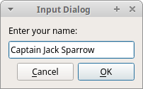

# PyQt6 的对话框
*最后更新于 2021.04.30*

对话是两个或更多人之间的交谈。在计算机程序中，对话框是用于与应用程序“交谈”的窗口，用于诸如从用户那里获取数据或更改应用程序设置之类的事情。

## PyQt6 QInputDialog
`QInputDialog` 提供了一个简单方便的对话框来从用户那里获取输入。输入值可以是字符串、数字或列表中的项目。

``` python
# file: input_dialog.py
#!/usr/bin/python

"""
ZetCode PyQt6 tutorial

In this example, we receive data from
a QInputDialog dialog.

Aauthor: Jan Bodnar
Website: zetcode.com
"""

from PyQt6.QtWidgets import (QWidget, QPushButton, QLineEdit,
        QInputDialog, QApplication)
import sys


class Example(QWidget):

    def __init__(self):
        super().__init__()

        self.initUI()


    def initUI(self):

        self.btn = QPushButton('Dialog', self)
        self.btn.move(20, 20)
        self.btn.clicked.connect(self.showDialog)

        self.le = QLineEdit(self)
        self.le.move(130, 22)

        self.setGeometry(300, 300, 450, 350)
        self.setWindowTitle('Input dialog')
        self.show()


    def showDialog(self):

        text, ok = QInputDialog.getText(self, 'Input Dialog',
                                        'Enter your name:')

        if ok:
            self.le.setText(str(text))


def main():

    app = QApplication(sys.argv)
    ex = Example()
    sys.exit(app.exec())


if __name__ == '__main__':
    main()
```
这个示例有一个按钮和行内编辑部件，按钮打开输入一个对话框，对话框里有一个文本输入框，用户输入的文本会显示在行内编辑部件里。

``` python
text, ok = QInputDialog.getText(self, 'Input Dialog',
    'Enter your name:')
```
这行代码打开了输入对话框，第一个参数是对话框标题，第二个参数是对话框里的提示信息。对话框会返回输入的文本和一个布尔值。如果点击 OK 按钮，这个布尔值是 `true`。

``` python
if ok:
    self.le.setText(str(text))
```
使用 `setText()` 从对话框里获取输入的文本。



图示：输入框

## PyQt6 QColorDialog
`QColorDialog` 是可以选择颜色对话框。

``` python
# file: color_dialog.py
#!/usr/bin/python

"""
ZetCode PyQt6 tutorial

In this example, we select a color value
from the QColorDialog and change the background
color of a QFrame widget.

Author: Jan Bodnar
Website: zetcode.com
"""

from PyQt6.QtWidgets import (QWidget, QPushButton, QFrame,
        QColorDialog, QApplication)
from PyQt6.QtGui import QColor
import sys


class Example(QWidget):

    def __init__(self):
        super().__init__()

        self.initUI()


    def initUI(self):

        col = QColor(0, 0, 0)

        self.btn = QPushButton('Dialog', self)
        self.btn.move(20, 20)

        self.btn.clicked.connect(self.showDialog)

        self.frm = QFrame(self)
        self.frm.setStyleSheet("QWidget { background-color: %s }"
                               % col.name())
        self.frm.setGeometry(130, 22, 200, 200)

        self.setGeometry(300, 300, 450, 350)
        self.setWindowTitle('Color dialog')
        self.show()


    def showDialog(self):

        col = QColorDialog.getColor()

        if col.isValid():

            self.frm.setStyleSheet("QWidget { background-color: %s }" 
                                   % col.name())


def main():

    app = QApplication(sys.argv)
    ex = Example()
    sys.exit(app.exec())


if __name__ == '__main__':
    main()
```
示例里有个按钮和一个 `QFrame`。部件的背景颜色是默认颜色，可以使用 `QColorDialog` 修改部件的背景颜色。
``` python
col = QColor(0, 0, 0)
```
这是 `QFrame` 的初始背景色。
``` python
col = QColorDialog.getColor()
```
这一行弹出 `QColorDialog` 。
``` python
if col.isValid():

    self.frm.setStyleSheet("QWidget { background-color: %s }" 
                           % col.name())
```
这里检查了颜色是不是有效的。如果点击取消按钮，没有返回可用的颜色值。如果返回的颜色是有效值，就使用样式表修改背景颜色。

## PyQt6 QFontDialog
`QFontDialog` 是选择字体的对话框。

``` python
# file: font_dialog.py
#!/usr/bin/python

"""
ZetCode PyQt6 tutorial

In this example, we select a font name
and change the font of a label.

Author: Jan Bodnar
Website: zetcode.com
"""

from PyQt6.QtWidgets import (QWidget, QVBoxLayout, QPushButton,
        QSizePolicy, QLabel, QFontDialog, QApplication)
import sys


class Example(QWidget):

    def __init__(self):
        super().__init__()

        self.initUI()


    def initUI(self):

        vbox = QVBoxLayout()

        btn = QPushButton('Dialog', self)
        btn.setSizePolicy(QSizePolicy.Policy.Fixed, QSizePolicy.Policy.Fixed)
        btn.move(20, 20)

        vbox.addWidget(btn)

        btn.clicked.connect(self.showDialog)

        self.lbl = QLabel('Knowledge only matters', self)
        self.lbl.move(130, 20)

        vbox.addWidget(self.lbl)
        self.setLayout(vbox)

        self.setGeometry(300, 300, 450, 350)
        self.setWindowTitle('Font dialog')
        self.show()


    def showDialog(self):

        font, ok = QFontDialog.getFont()

        if ok:
            self.lbl.setFont(font)


def main():

    app = QApplication(sys.argv)
    ex = Example()
    sys.exit(app.exec())


if __name__ == '__main__':
    main()
```
本例中，有个有文本的按钮。使用 `QFontDialog` 可以修改按钮文本的字体。
``` python
font, ok = QFontDialog.getFont()
```
这里弹出了字体选择对话框。`getFont` 方法返回了选择的字体名称和 `ok` 参数，如果点击 Ok 按钮，`ok` 的值是 `True`，反则是 `False`。
``` python
if ok:
    self.label.setFont(font)
```
如果点击 Ok 按钮，`setFont` 方法会修改文本的字体。

## PyQt6 QFileDialog

`QFileDialog` 是选择文件或者文件夹的对话框，可以用作选择或者保存操作。

``` python
# file: file_dialog.py
#!/usr/bin/python

"""
ZetCode PyQt6 tutorial

In this example, we select a file with a
QFileDialog and display its contents
in a QTextEdit.

Author: Jan Bodnar
Website: zetcode.com
"""

from PyQt6.QtWidgets import (QMainWindow, QTextEdit,
        QFileDialog, QApplication)
from PyQt6.QtGui import QIcon, QAction
from pathlib import Path
import sys


class Example(QMainWindow):

    def __init__(self):
        super().__init__()

        self.initUI()


    def initUI(self):

        self.textEdit = QTextEdit()
        self.setCentralWidget(self.textEdit)
        self.statusBar()

        openFile = QAction(QIcon('open.png'), 'Open', self)
        openFile.setShortcut('Ctrl+O')
        openFile.setStatusTip('Open new File')
        openFile.triggered.connect(self.showDialog)

        menubar = self.menuBar()
        fileMenu = menubar.addMenu('&File')
        fileMenu.addAction(openFile)

        self.setGeometry(300, 300, 550, 450)
        self.setWindowTitle('File dialog')
        self.show()


    def showDialog(self):

        home_dir = str(Path.home())
        fname = QFileDialog.getOpenFileName(self, 'Open file', home_dir)

        if fname[0]:

            f = open(fname[0], 'r')

            with f:

                data = f.read()
                self.textEdit.setText(data)


def main():

    app = QApplication(sys.argv)
    ex = Example()
    sys.exit(app.exec())


if __name__ == '__main__':
    main()
```
该示例有一个有居中显示的文本编辑部件的菜单栏和一个状态栏。菜单项显示了用于选择文件的 `QFileDialog`。文件的内容被加载到文本编辑小部件中。
``` python
class Example(QMainWindow):

    def __init__(self):
        super().__init__()

        self.initUI()
```
示例是基于 `QMainWindow` 部件，是因为需要把文本编辑部件居中显示。
``` python
home_dir = str(Path.home())
fname = QFileDialog.getOpenFileName(self, 'Open file', home_dir)
```
这里弹出 `QFileDialog`。`getOpenFileName` 的第一个参数字符串是标题，第二个字符串指定对话框工作目录。我们使用 `path` 模块来确定用户的主目录。默认情况下，文件过滤器设置为所有文件 (*)。

``` python
if fname[0]:

    f = open(fname[0], 'r')

    with f:

        data = f.read()
        self.textEdit.setText(data)
```
读取选择文件并把内容放置岛文本编辑部件里。

本章教程，我们学习了对话框。
