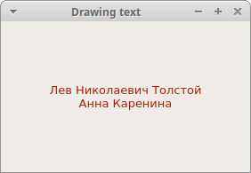
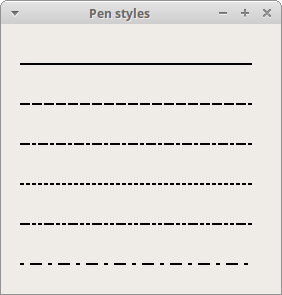
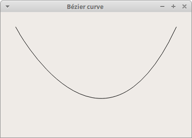

# PyQt6 的绘制
*最后更新于 2021.03.15*

PyQt6绘画系统能够呈现矢量图形、图像和基于字体的文本轮廓。想要更改或增强现有的小部件，或者从头创建自定义小部件时，需要 PyQt6 工具包提供的绘图 API 进行绘制。
## QPainter
QPainter 在小部件和其他可绘制单元上执行底层绘制。从简单的线条到复杂的形状，它可以画任何东西。

## paintEvent 方法
绘制时由 paintEvent 方法完成的。绘制代码位于 QPainter 对象的开始和结束方法之间。它在小部件和其他绘制单元上执行底层绘制。

## PyQt6 绘制文本
从绘制一些 Unicode 文本开始。

``` python
# file: draw_text.py
#!/usr/bin/python

"""
ZetCode PyQt6 tutorial

In this example, we draw text in Russian Cylliric.

Author: Jan Bodnar
Website: zetcode.com
"""

import sys
from PyQt6.QtWidgets import QWidget, QApplication
from PyQt6.QtGui import QPainter, QColor, QFont
from PyQt6.QtCore import Qt


class Example(QWidget):

    def __init__(self):
        super().__init__()

        self.initUI()


    def initUI(self):

        self.text = "Лев Николаевич Толстой\nАнна Каренина"

        self.setGeometry(300, 300, 350, 300)
        self.setWindowTitle('Drawing text')
        self.show()


    def paintEvent(self, event):

        qp = QPainter()
        qp.begin(self)
        self.drawText(event, qp)
        qp.end()


    def drawText(self, event, qp):

        qp.setPen(QColor(168, 34, 3))
        qp.setFont(QFont('Decorative', 10))
        qp.drawText(event.rect(), Qt.Alignment.AlignCenter, self.text)


def main():

    app = QApplication(sys.argv)
    ex = Example()
    sys.exit(app.exec())


if __name__ == '__main__':
    main()
```
本例中，绘制了一些西里尔字母，并水平和垂直对齐了文本。

``` python
def paintEvent(self, event):
...
```
使用 paintEvent 完成绘画。

``` python
qp = QPainter()
qp.begin(self)
self.drawText(event, qp)
qp.end()
```
`QPainter` 类负责所有的底层绘制。所有的绘制都在开始和结束方法之间。实际的绘制被委托给 drawText 方法。
``` python
qp.setPen(QColor(168, 34, 3))
qp.setFont(QFont('Decorative', 10))
```
这里定义了绘制文本的笔触和字体。

``` python
qp.drawText(event.rect(), Qt.Alignment.AlignCenter, self.text)
```
drawText 方法在窗口上绘制文本。paintEvent 的rect方法返回需要更新的矩形。用 `Qt.Alignment.AlignCenter` 在两个维度上对齐文本。



图示：绘制文本

## PyQt6 绘制点
点是绘制里最简单的图形对象。

``` python
# file: draw_points.py
#!/usr/bin/python

"""
ZetCode PyQt6 tutorial

In the example, we draw randomly 1000 red points
on the window.

Author: Jan Bodnar
Website: zetcode.com
"""

from PyQt6.QtWidgets import QWidget, QApplication
from PyQt6.QtGui import QPainter
from PyQt6.QtCore import Qt
import sys, random


class Example(QWidget):

    def __init__(self):
        super().__init__()

        self.initUI()


    def initUI(self):

        self.setMinimumSize(50, 50)
        self.setGeometry(300, 300, 350, 300)
        self.setWindowTitle('Points')
        self.show()


    def paintEvent(self, e):

        qp = QPainter()
        qp.begin(self)
        self.drawPoints(qp)
        qp.end()


    def drawPoints(self, qp):

        qp.setPen(Qt.GlobalColor.red)
        size = self.size()

        for i in range(1000):

            x = random.randint(1, size.width() - 1)
            y = random.randint(1, size.height() - 1)
            qp.drawPoint(x, y)


def main():

    app = QApplication(sys.argv)
    ex = Example()
    sys.exit(app.exec())


if __name__ == '__main__':
    main()
```
上例中，在窗口里绘制了1000个随机的红点。

``` python
qp.setPen(Qt.GlobalColor.red)
```
用预定义 `Qt.GlobalColor.red` 常量常量把笔触设置为红色。
``` python
size = self.size()
```
每次改变窗口大小，都会产生一个绘制事件。获得当前窗口大小，根据这个大小把点分布到窗口上的各个位置。

``` python
qp.drawPoint(x, y)
```
使用 `drawPoint` 方法绘制点。


图示：点

## PyQt6 颜色

颜色是表示红色、绿色和蓝色 (RGB) 强度值组合的对象。有效的 RGB 值的范围是0到255。可以用不同的方法定义一种颜色。最常见的是RGB十进制值或十六进制值。还可以使用 RGBA 值，它代表红色、绿色、蓝色和 Alpha 通道，添加了透明度信息。Alpha 值为255定义完全不透明，0表示完全透明，也就是颜色不可见。

``` python
# file: colours.py
#!/usr/bin/python

"""
ZetCode PyQt6 tutorial

This example draws three rectangles in three
different colours.

Author: Jan Bodnar
Website: zetcode.com
"""

from PyQt6.QtWidgets import QWidget, QApplication
from PyQt6.QtGui import QPainter, QColor
import sys


class Example(QWidget):

    def __init__(self):
        super().__init__()

        self.initUI()


    def initUI(self):

        self.setGeometry(300, 300, 350, 100)
        self.setWindowTitle('Colours')
        self.show()


    def paintEvent(self, e):

        qp = QPainter()
        qp.begin(self)
        self.drawRectangles(qp)
        qp.end()


    def drawRectangles(self, qp):

        col = QColor(0, 0, 0)
        col.setNamedColor('#d4d4d4')
        qp.setPen(col)

        qp.setBrush(QColor(200, 0, 0))
        qp.drawRect(10, 15, 90, 60)

        qp.setBrush(QColor(255, 80, 0, 160))
        qp.drawRect(130, 15, 90, 60)

        qp.setBrush(QColor(25, 0, 90, 200))
        qp.drawRect(250, 15, 90, 60)


def main():

    app = QApplication(sys.argv)
    ex = Example()
    sys.exit(app.exec())


if __name__ == '__main__':
    main()
```
上例中，绘制了三个不同颜色的矩形。

``` python
color = QColor(0, 0, 0)
color.setNamedColor('#d4d4d4')
```
使用16进制定义颜色。

``` python
qp.setBrush(QColor(200, 0, 0))
qp.drawRect(10, 15, 90, 60)
```
这里定义一个笔刷并绘制一个矩形。画笔是一种基本的图形对象，用于绘制形状的背景。drawRect 方法接受四个参数，前两个是轴上的x和y值，第三和第四个参数是矩形的宽度和高度，使用选择的笔触和笔刷绘制矩形。


图示：颜色

## PyQt6 QPen
`QPen` 是一个基本图形对象，可以绘制线条，曲线和矩形，椭圆，多边形等形状的轮廓。

``` python
# file: pens.py
#!/usr/bin/python

"""
ZetCode PyQt6 tutorial

In this example we draw 6 lines using
different pen styles.

Author: Jan Bodnar
Website: zetcode.com
"""

from PyQt6.QtWidgets import QWidget, QApplication
from PyQt6.QtGui import QPainter, QPen
from PyQt6.QtCore import Qt
import sys


class Example(QWidget):

    def __init__(self):
        super().__init__()

        self.initUI()


    def initUI(self):

        self.setGeometry(300, 300, 280, 270)
        self.setWindowTitle('Pen styles')
        self.show()


    def paintEvent(self, e):

        qp = QPainter()
        qp.begin(self)
        self.drawLines(qp)
        qp.end()


    def drawLines(self, qp):

        pen = QPen(Qt.GlobalColor.black, 2, Qt.PenStyle.SolidLine)

        qp.setPen(pen)
        qp.drawLine(20, 40, 250, 40)

        pen.setStyle(Qt.PenStyle.DashLine)
        qp.setPen(pen)
        qp.drawLine(20, 80, 250, 80)

        pen.setStyle(Qt.PenStyle.DashDotLine)
        qp.setPen(pen)
        qp.drawLine(20, 120, 250, 120)

        pen.setStyle(Qt.PenStyle.DotLine)
        qp.setPen(pen)
        qp.drawLine(20, 160, 250, 160)

        pen.setStyle(Qt.PenStyle.DashDotDotLine)
        qp.setPen(pen)
        qp.drawLine(20, 200, 250, 200)

        pen.setStyle(Qt.PenStyle.CustomDashLine)
        pen.setDashPattern([1, 4, 5, 4])
        qp.setPen(pen)
        qp.drawLine(20, 240, 250, 240)


def main():
    
    app = QApplication(sys.argv)
    ex = Example()
    sys.exit(app.exec())


if __name__ == '__main__':
    main()
```

示例中，我们画了6条线。线条是用六种不同的笔触风格样式的。有五种预定义的笔触。我们也可以创建自定义笔触样式。最后一条线是使用自定义笔触风格样式的。

``` python
pen = QPen(Qt.GlobalColor.black, 2, Qt.PenStyle.SolidLine)
```
这里创建了一个 `QPen` 对象，颜色是黑色，宽度2像素，这样就能区别不同的笔触。`Qt.SolidLine` 是一个预定义的笔触。

``` python
pen.setStyle(Qt.PenStyle.CustomDashLine)
pen.setDashPattern([1, 4, 5, 4])
qp.setPen(pen)
```
这里我们自定义了一个笔触。样式设置为 `Qt.PenStyle。CustomDashLine`，用 `setDashPattern` 方法设置具体样式，参数一定是偶数个，奇数定义破折号，偶数定义空格。数字越大，空格或破折号就越大。这里设置的是1px横线，4px空格，5px横线，4px空格等等。



图示：笔触样式

## PyQt6 QBrush
`QBrush` 是一个基本图形对象。它用于绘制矩形、椭圆等形状的背景。笔刷有三种类型：预定义的笔刷、渐变或纹理模式。

``` python
# file: brushes.py
#!/usr/bin/python

"""
ZetCode PyQt6 tutorial

This example draws nine rectangles in different
brush styles.

Author: Jan Bodnar
Website: zetcode.com
"""

from PyQt6.QtWidgets import QWidget, QApplication
from PyQt6.QtGui import QPainter, QBrush
from PyQt6.QtCore import Qt
import sys


class Example(QWidget):

    def __init__(self):
        super().__init__()

        self.initUI()


    def initUI(self):

        self.setGeometry(300, 300, 355, 280)
        self.setWindowTitle('Brushes')
        self.show()


    def paintEvent(self, e):

        qp = QPainter()
        qp.begin(self)
        self.drawBrushes(qp)
        qp.end()


    def drawBrushes(self, qp):

        brush = QBrush(Qt.BrushStyle.SolidPattern)
        qp.setBrush(brush)
        qp.drawRect(10, 15, 90, 60)

        brush.setStyle(Qt.BrushStyle.Dense1Pattern)
        qp.setBrush(brush)
        qp.drawRect(130, 15, 90, 60)

        brush.setStyle(Qt.BrushStyle.Dense2Pattern)
        qp.setBrush(brush)
        qp.drawRect(250, 15, 90, 60)

        brush.setStyle(Qt.BrushStyle.DiagCrossPattern)
        qp.setBrush(brush)
        qp.drawRect(10, 105, 90, 60)

        brush.setStyle(Qt.BrushStyle.Dense5Pattern)
        qp.setBrush(brush)
        qp.drawRect(130, 105, 90, 60)

        brush.setStyle(Qt.BrushStyle.Dense6Pattern)
        qp.setBrush(brush)
        qp.drawRect(250, 105, 90, 60)

        brush.setStyle(Qt.BrushStyle.HorPattern)
        qp.setBrush(brush)
        qp.drawRect(10, 195, 90, 60)

        brush.setStyle(Qt.BrushStyle.VerPattern)
        qp.setBrush(brush)
        qp.drawRect(130, 195, 90, 60)

        brush.setStyle(Qt.BrushStyle.BDiagPattern)
        qp.setBrush(brush)
        qp.drawRect(250, 195, 90, 60)


def main():

    app = QApplication(sys.argv)
    ex = Example()
    sys.exit(app.exec())


if __name__ == '__main__':
    main()
```
示例中绘制了9个不同的矩形。

``` python
brush = QBrush(Qt.BrushStyle.SolidPattern)
qp.setBrush(brush)
qp.drawRect(10, 15, 90, 60)
```
这里定义了一个笔刷对象，调用 drawRect 方法绘制矩形。


图示：笔刷

## 贝塞尔曲线
贝塞尔曲线是三次方曲线。PyQt6 中的贝塞尔曲线可以用 `QPainterPath` 创建。画线路径是由许多图形构建块(如矩形、椭圆、直线和曲线)组成的对象。

``` python
# file: bezier_curve.py
#!/usr/bin/python

"""
ZetCode PyQt6 tutorial

This program draws a Bézier curve with
QPainterPath.

Author: Jan Bodnar
Website: zetcode.com
"""

import sys

from PyQt6.QtGui import QPainter, QPainterPath
from PyQt6.QtWidgets import QWidget, QApplication


class Example(QWidget):

    def __init__(self):
        super().__init__()

        self.initUI()


    def initUI(self):

        self.setGeometry(300, 300, 380, 250)
        self.setWindowTitle('Bézier curve')
        self.show()


    def paintEvent(self, e):

        qp = QPainter()
        qp.begin(self)
        qp.setRenderHint(QPainter.RenderHints.Antialiasing)
        self.drawBezierCurve(qp)
        qp.end()


    def drawBezierCurve(self, qp):
    
        path = QPainterPath()
        path.moveTo(30, 30)
        path.cubicTo(30, 30, 200, 350, 350, 30)

        qp.drawPath(path)


def main():

    app = QApplication(sys.argv)
    ex = Example()
    sys.exit(app.exec())


if __name__ == '__main__':
    main()
```
This example draws a Bézier curve.

```python
path = QPainterPath()
path.moveTo(30, 30)
path.cubicTo(30, 30, 200, 350, 350, 30)
```
使用 `QPainterPath` 创建贝塞尔曲线路径。使用 `cubicTo` 方法绘制曲线，该方法需要三个点：起始点，控制点，结束点。

``` python
qp.drawPath(path)
```
使用 drawPath 方法绘制最终的路径。



图示：贝塞尔曲线

本章讲解了基本的绘画。