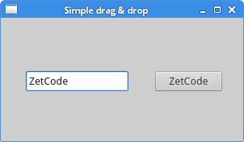

# 拖拽

本章讲述的是拖放操作

在GUI里，拖放是指用户点击一个虚拟的对象，拖动，然后放置到另外一个对象上面的动作。一般情况下，需要调用很多动作和方法，创建很多变量。

拖放能让用户很直观的操作很复杂的逻辑。

一般情况下，我们可以拖放两种东西：数据和图形界面。把一个图像从一个应用拖放到另外一个应用上的实质是操作二进制数据。吧一个表格从Firefox上拖放到另外一个位置 的实质是操作一个图形组。

## 简单的拖放

本例使用了`QLineEdit`和`QPushButton`。把一个文本从编辑框里拖到按钮上，更新按钮上的标签（文字）。
```
#!/usr/bin/python3
# -*- coding: utf-8 -*-

"""
ZetCode PyQt5 tutorial

This is a simple drag and
drop example. 

author: Jan Bodnar
website: zetcode.com
last edited: January 2015
"""

import sys
from PyQt5.QtWidgets import (QPushButton, QWidget, 
    QLineEdit, QApplication)

class Button(QPushButton):
  
    def __init__(self, title, parent):
        super().__init__(title, parent)
        
        self.setAcceptDrops(True)
        

    def dragEnterEvent(self, e):
      
        if e.mimeData().hasFormat('text/plain'):
            e.accept()
        else:
            e.ignore() 

    def dropEvent(self, e):
        
        self.setText(e.mimeData().text()) 


class Example(QWidget):
  
    def __init__(self):
        super().__init__()
        
        self.initUI()
        
        
    def initUI(self):

        edit = QLineEdit('', self)
        edit.setDragEnabled(True)
        edit.move(30, 65)

        button = Button("Button", self)
        button.move(190, 65)
        
        self.setWindowTitle('Simple drag & drop')
        self.setGeometry(300, 300, 300, 150)


if __name__ == '__main__':
  
    app = QApplication(sys.argv)
    ex = Example()
    ex.show()
    app.exec_()
```

```
class Button(QPushButton):
  
    def __init__(self, title, parent):
        super().__init__(title, parent)
        
        self.setAcceptDrops(True)
```
为了完成预定目标，我们要重构一些方法。首先用`QPushButton`上构造一个按钮实例。
```
self.setAcceptDrops(True)
```
激活组件的拖拽事件。
```
def dragEnterEvent(self, e):
    
    if e.mimeData().hasFormat('text/plain'):
        e.accept()
    else:
        e.ignore() 
```
首先，我们重构了`dragEnterEvent()`方法。设定好接受拖拽的数据类型（plain text）。
```
def dropEvent(self, e):

    self.setText(e.mimeData().text()) 
```
然后重构`dropEvent()`方法，更改按钮接受鼠标的释放事件的默认行为。
```
edit = QLineEdit('', self)
edit.setDragEnabled(True)
```
`QLineEdit`默认支持拖拽操作，所以我们只要调用`setDragEnabled()`方法使用就行了。

程序展示：



## Drag & drop a button widget

In the following example, we will demonstrate how to drag & drop a button widget.

#!/usr/bin/python3
# -*- coding: utf-8 -*-

"""
ZetCode PyQt5 tutorial

In this program, we can press on a button with 
a left mouse click or drag and drop the button 
with the right mouse click. 

author: Jan Bodnar
website: zetcode.com
last edited: January 2015
"""

import sys
from PyQt5.QtWidgets import QPushButton, QWidget, QApplication
from PyQt5.QtCore import Qt, QMimeData
from PyQt5.QtGui import QDrag


class Button(QPushButton):
  
    def __init__(self, title, parent):
        super().__init__(title, parent)
        

    def mouseMoveEvent(self, e):

        if e.buttons() != Qt.RightButton:
            return

        mimeData = QMimeData()

        drag = QDrag(self)
        drag.setMimeData(mimeData)
        drag.setHotSpot(e.pos() - self.rect().topLeft())

        dropAction = drag.exec_(Qt.MoveAction)


    def mousePressEvent(self, e):
      
        QPushButton.mousePressEvent(self, e)
        
        if e.button() == Qt.LeftButton:
            print('press')


class Example(QWidget):
  
    def __init__(self):
        super().__init__()

        self.initUI()
        
        
    def initUI(self):

        self.setAcceptDrops(True)

        self.button = Button('Button', self)
        self.button.move(100, 65)

        self.setWindowTitle('Click or Move')
        self.setGeometry(300, 300, 280, 150)
        

    def dragEnterEvent(self, e):
      
        e.accept()
        

    def dropEvent(self, e):

        position = e.pos()
        self.button.move(position)

        e.setDropAction(Qt.MoveAction)
        e.accept()
        

if __name__ == '__main__':
  
    app = QApplication(sys.argv)
    ex = Example()
    ex.show()
    app.exec_()  
In our code example, we have a QPushButton on the window. If we click on the button with a left mouse button, the 'press' message is printed to the console. By right clicking and moving the button, we perform a drag & drop operation on the button widget.

class Button(QPushButton):
  
    def __init__(self, title, parent):
        super().__init__(title, parent)
We create a Button class which derives from the QPushButton. We also reimplement two methods of the QPushButton: the mouseMoveEvent() and the mousePressEvent(). The mouseMoveEvent() method is the place where the drag & drop operation begins.

if e.buttons() != Qt.RightButton:
    return
Here we decide that we can perform drag & drop only with a right mouse button. The left mouse button is reserved for clicking on the button.

mimeData = QMimeData()

drag = QDrag(self)
drag.setMimeData(mimeData)
drag.setHotSpot(e.pos() - self.rect().topLeft())
The QDrag object is created. The class provides support for MIME-based drag and drop data transfer.

dropAction = drag.exec_(Qt.MoveAction)
The start() method of the drag object starts the drag & drop operation.

def mousePressEvent(self, e):
    
    QPushButton.mousePressEvent(self, e)
    
    if e.button() == Qt.LeftButton:
        print('press')
We print 'press' to the console if we left click on the button with the mouse. Notice that we call mousePressEvent() method on the parent as well. Otherwise, we would not see the button being pushed.

position = e.pos()
self.button.move(position)
In the dropEvent() method we code what happens after we release the mouse button and finish the drop operation. We find out the current mouse pointer position and move the button accordingly.

e.setDropAction(Qt.MoveAction)
e.accept()
We specify the type of the drop action. In our case it is a move action.