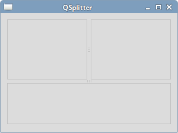

# 控件2

本章我们继续介绍PyQt5控件。这次的有`QPixmap`，`QLineEdit`，`QSplitter`，和`QComboBox`。

## QPixmap

`QPixmap`是处理图片的组件。本例中，我们使用`QPixmap`在窗口里显示一张图片。
```
#!/usr/bin/python3
# -*- coding: utf-8 -*-

"""
ZetCode PyQt5 tutorial 

In this example, we dispay an image
on the window. 

author: Jan Bodnar
website: zetcode.com 
last edited: January 2015
"""

import sys
from PyQt5.QtWidgets import (QWidget, QHBoxLayout, 
    QLabel, QApplication)
from PyQt5.QtGui import QPixmap


class Example(QWidget):
    
    def __init__(self):
        super().__init__()
        
        self.initUI()
        
        
    def initUI(self):      

        hbox = QHBoxLayout(self)
        pixmap = QPixmap("redrock.png")

        lbl = QLabel(self)
        lbl.setPixmap(pixmap)

        hbox.addWidget(lbl)
        self.setLayout(hbox)
        
        self.move(300, 200)
        self.setWindowTitle('Red Rock')
        self.show()        
        
        
if __name__ == '__main__':
    
    app = QApplication(sys.argv)
    ex = Example()
    sys.exit(app.exec_())
```
```
pixmap = QPixmap("redrock.png")
```
创建一个`QPixmap`对象，接收一个文件作为参数。
```
lbl = QLabel(self)
lbl.setPixmap(pixmap)
```
把`QPixmap`实例放到`QLabel`组件里。

## QLineEdit

`QLineEdit`组件提供了编辑文本的功能，自带了撤销、重做、剪切、粘贴、拖拽等功能。
```
#!/usr/bin/python3
# -*- coding: utf-8 -*-

"""
ZetCode PyQt5 tutorial 

This example shows text which 
is entered in a QLineEdit
in a QLabel widget.
 
author: Jan Bodnar
website: zetcode.com 
last edited: January 2015
"""

import sys
from PyQt5.QtWidgets import (QWidget, QLabel, 
    QLineEdit, QApplication)


class Example(QWidget):
    
    def __init__(self):
        super().__init__()
        
        self.initUI()
        
        
    def initUI(self):      

        self.lbl = QLabel(self)
        qle = QLineEdit(self)
        
        qle.move(60, 100)
        self.lbl.move(60, 40)

        qle.textChanged[str].connect(self.onChanged)
        
        self.setGeometry(300, 300, 280, 170)
        self.setWindowTitle('QLineEdit')
        self.show()
        
        
    def onChanged(self, text):
        
        self.lbl.setText(text)
        self.lbl.adjustSize()        
        
        
if __name__ == '__main__':
    
    app = QApplication(sys.argv)
    ex = Example()
    sys.exit(app.exec_())
```
例子中展示了一个编辑组件和一个标签，我们在输入框里键入的文本，会立即在标签里显示出来。
```
qle = QLineEdit(self)
```
创建一个`QLineEdit`对象。
```
qle.textChanged[str].connect(self.onChanged)
```
如果输入框的值有变化，就调用`onChanged()`方法。
```
def onChanged(self, text):
    
    self.lbl.setText(text)
    self.lbl.adjustSize() 
```
在`onChanged()`方法内部，我们把文本框里的值赋值给了标签组件，然后调用`adjustSize()`方法让标签自适应文本内容。

程序展示：


## QSplitter

`QSplitter`组件能让用户通过拖拽分割线的方式改变子窗口大小的组件。本例中我们展示用两个分割线隔开的三个`QFrame`组件。
```
#!/usr/bin/python3
# -*- coding: utf-8 -*-

"""
ZetCode PyQt5 tutorial 

This example shows
how to use QSplitter widget.
 
author: Jan Bodnar
website: zetcode.com 
last edited: January 2015
"""

import sys
from PyQt5.QtWidgets import (QWidget, QHBoxLayout, QFrame, 
    QSplitter, QStyleFactory, QApplication)
from PyQt5.QtCore import Qt


class Example(QWidget):
    
    def __init__(self):
        super().__init__()
        
        self.initUI()
        
        
    def initUI(self):      

        hbox = QHBoxLayout(self)

        topleft = QFrame(self)
        topleft.setFrameShape(QFrame.StyledPanel)
 
        topright = QFrame(self)
        topright.setFrameShape(QFrame.StyledPanel)

        bottom = QFrame(self)
        bottom.setFrameShape(QFrame.StyledPanel)

        splitter1 = QSplitter(Qt.Horizontal)
        splitter1.addWidget(topleft)
        splitter1.addWidget(topright)

        splitter2 = QSplitter(Qt.Vertical)
        splitter2.addWidget(splitter1)
        splitter2.addWidget(bottom)

        hbox.addWidget(splitter2)
        self.setLayout(hbox)
        
        self.setGeometry(300, 300, 300, 200)
        self.setWindowTitle('QSplitter')
        self.show()
        
        
    def onChanged(self, text):
        
        self.lbl.setText(text)
        self.lbl.adjustSize()        
        
        
if __name__ == '__main__':
    
    app = QApplication(sys.argv)
    ex = Example()
    sys.exit(app.exec_()) 
```
In our example, we have three frame widgets and two splitters. Note that under some themes, the splitters may not be visible very well.
```
topleft = QFrame(self)
topleft.setFrameShape(QFrame.StyledPanel)
```
We use a styled frame in order to see the boundaries between the QFrame widgets.
```
splitter1 = QSplitter(Qt.Horizontal)
splitter1.addWidget(topleft)
splitter1.addWidget(topright)
```
We create a QSplitter widget and add two frames into it.
```
splitter2 = QSplitter(Qt.Vertical)
splitter2.addWidget(splitter1)
```
We can also add a splitter to another splitter widget.



##QComboBox

The QComboBox is a widget that allows a user to choose from a list of options.

#!/usr/bin/python3
# -*- coding: utf-8 -*-

"""
ZetCode PyQt5 tutorial 

This example shows how to use 
a QComboBox widget.
 
author: Jan Bodnar
website: zetcode.com 
last edited: January 2015
"""

import sys
from PyQt5.QtWidgets import (QWidget, QLabel, 
    QComboBox, QApplication)


class Example(QWidget):
    
    def __init__(self):
        super().__init__()
        
        self.initUI()
        
        
    def initUI(self):      

        self.lbl = QLabel("Ubuntu", self)

        combo = QComboBox(self)
        combo.addItem("Ubuntu")
        combo.addItem("Mandriva")
        combo.addItem("Fedora")
        combo.addItem("Arch")
        combo.addItem("Gentoo")

        combo.move(50, 50)
        self.lbl.move(50, 150)

        combo.activated[str].connect(self.onActivated)        
         
        self.setGeometry(300, 300, 300, 200)
        self.setWindowTitle('QComboBox')
        self.show()
        
        
    def onActivated(self, text):
      
        self.lbl.setText(text)
        self.lbl.adjustSize()  
        
                
if __name__ == '__main__':
    
    app = QApplication(sys.argv)
    ex = Example()
    sys.exit(app.exec_())
The example shows a QComboBox and a QLabel. The combo box has a list of five options. These are the names of Linux distros. The label widget displays the selected option from the combo box.

combo = QComboBox(self)
combo.addItem("Ubuntu")
combo.addItem("Mandriva")
combo.addItem("Fedora")
combo.addItem("Arch")
combo.addItem("Gentoo")
We create a QComboBox widget with five options.

combo.activated[str].connect(self.onActivated) 
Upon an item selection, we call the onActivated() method.

def onActivated(self, text):
  
    self.lbl.setText(text)
    self.lbl.adjustSize() 
Inside the method, we set the text of the chosen item to the label widget. We adjust the size of the label.

QComboBox
Figure: QComboBox